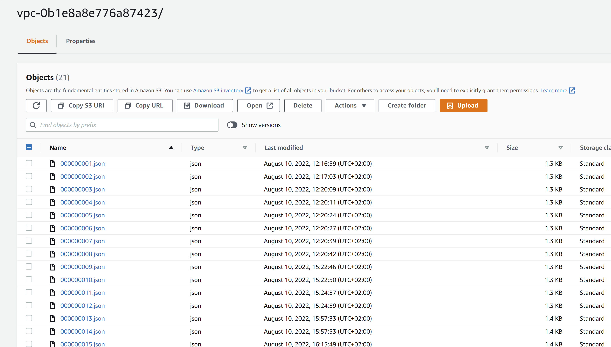
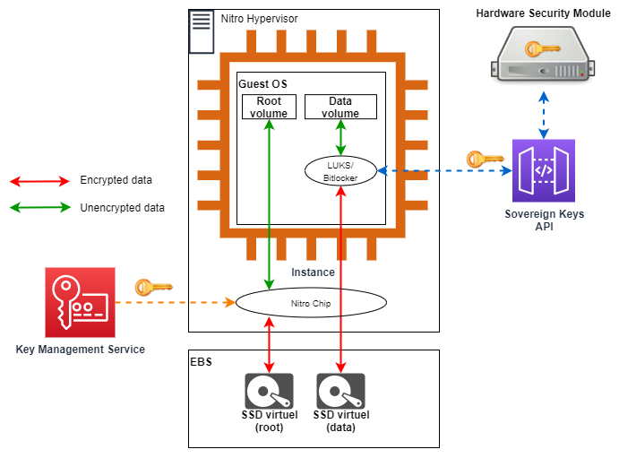
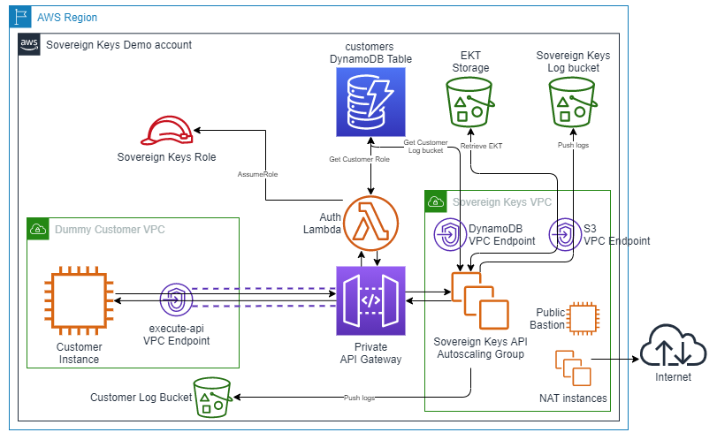
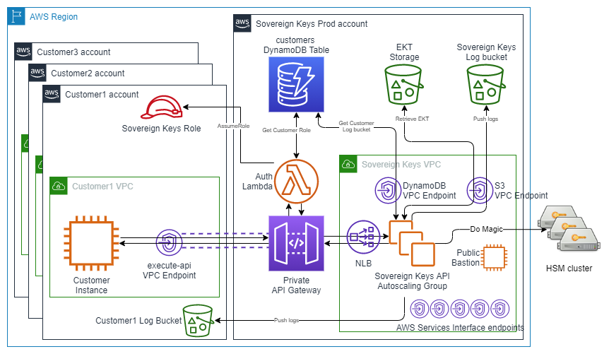
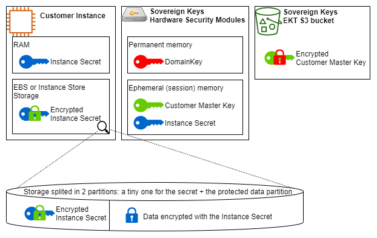
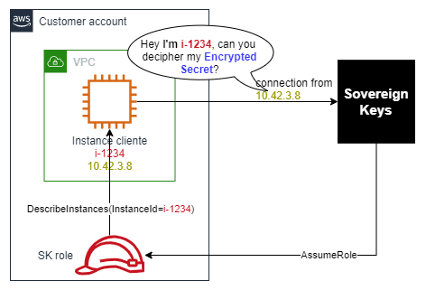
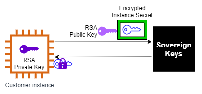
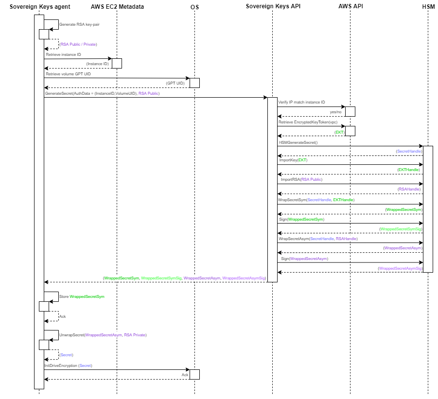
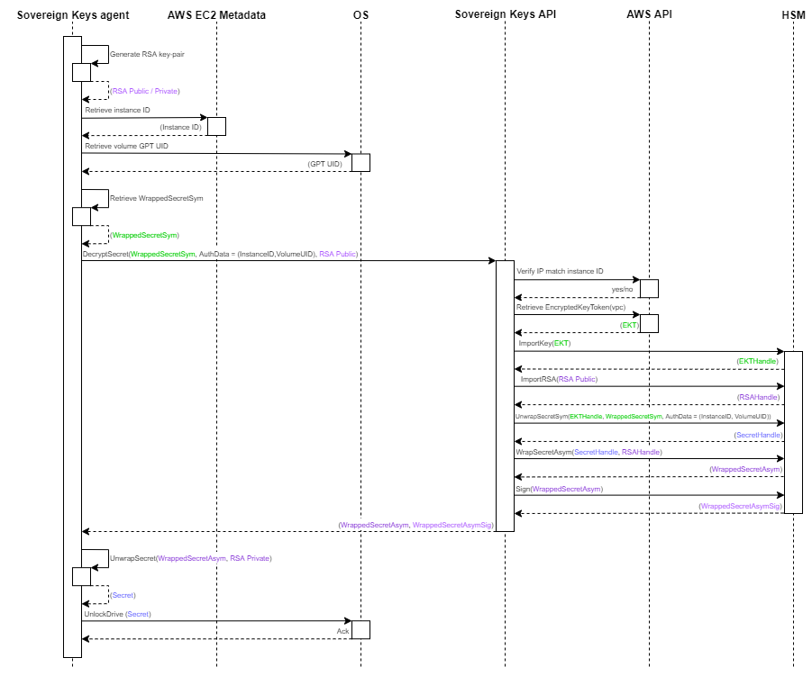
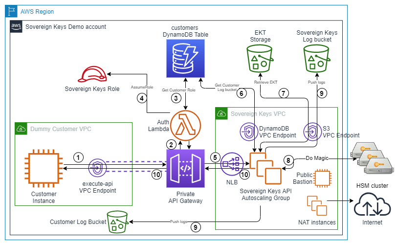

<div id="top"></div>
<!--
*** Thanks for checking out the Best-README-Template. If you have a suggestion
*** that would make this better, please fork the repo and create a pull request
*** or simply open an issue with the tag "enhancement".
*** Don't forget to give the project a star!
*** Thanks again! Now go create something AMAZING! :D
-->

<!-- PROJECT SHIELDS -->
<!--
*** I'm using markdown "reference style" links for readability.
*** Reference links are enclosed in brackets [ ] instead of parentheses ( ).
*** See the bottom of this document for the declaration of the reference variables
*** for contributors-url, forks-url, etc. This is an optional, concise syntax you may use.
*** https://www.markdownguide.org/basic-syntax/#reference-style-links
-->

[![Contributors][contributors-shield]][contributors-url]
[![Forks][forks-shield]][forks-url]
[![Stargazers][stars-shield]][stars-url]
[![Issues][issues-shield]][issues-url]
[![GNU GPLv3 License][license-shield]][license-url]
[![LinkedIn][linkedin-shield]][linkedin-url]


<!-- PROJECT LOGO -->
<br />
<div align="center">
  <a href="https://github.com/d2si/sovereign-keys">
    
  </a>

<h3 align="center">Sovereign Keys</h3>

  <p align="center">
    An encryption system for AWS EC2 instances using external, customer owned HSMs as a backend
    <br />
    <a href="https://github.com/d2si/sovereign-keys"><strong>Explore the docs »</strong></a>
    <br />
    <br />
    <a href="https://github.com/d2si/sovereign-keys">View Demo</a>
    ·
    <a href="https://github.com/d2si/sovereign-keys/issues">Report Bug</a>
    ·
    <a href="https://github.com/d2si/sovereign-keys/issues">Request Feature</a>
  </p>
</div>

<!-- TABLE OF CONTENTS -->
<details>
  <summary>Table of Contents</summary>
  <ol>
    <li>
      <a href="#about-the-project">About The Project</a>
      <ul>
        <li><a href="#supported-cloud-provider-and-service">Supported Cloud provider and service</a></li>
        <li><a href="#supported-operating-systems-and-platform">Supported Operating Systems and platform</a></li>
        <li><a href="#supported-hsms">Supported HSMs</a></li>
      </ul>
    </li>
    <li>
      <a href="#getting-started">Getting Started</a>
      <ul>
        <li><a href="#prerequisites">Prerequisites</a></li>
        <li><a href="#aws-costs">AWS Costs</a></li>
        <li>
            <a href="#installation">Installation</a>
            <ul>
                <li><a href="#initial-sovereign-keys-provisioning">Initial Sovereign Keys provisioning</a></li>
                <li><a href="#configure-ssh-on-the-bastion-instance">Configure SSH on the Bastion instance</a></li>
                <li><a href="#alternative-1-adding-a-cloudhsm-cluster">(Alternative 1) Adding a CloudHSM cluster</a></li>
                <li><a href="#alternative-2-going-for-an-external-proteccio-nethsm-cluster">(Alternative 2) Going for an external Proteccio netHSM cluster</a></li>
                <li><a href="#finalizing-the-api-installation">Finalizing the API installation</a></li>
                <li><a href="#configuring-the-customer-agent">Configuring the customer agent</a></li>
            </ul>
        </li>
        <li><a href="#usage">Usage</a></li>
        <li><a href="#destroy-and-recreate-resources">Destroy and recreate resources</a></li>
      </ul>
    </li>
    <li>
      <a href="#architecture">Architecture</a>
      <ul>
        <li><a href="#functional-design">Functional Design</a></li>
        <li><a href="#technical-overview">Technical Overview</a></li>
        <li><a href="#cryptographic-security">Cryptographic security</a></li>
        <li><a href="#key-hierarchy">Key hierarchy</a></li>
        <li><a href="#customer-instance-interactions-with-sovereign-keys">Customer instance interactions with Sovereign Keys</a></li>
      </ul>
    </li>
    <li><a href="#contributing">Contributing</a></li>
    <li><a href="#license">License</a></li>
    <li><a href="#contact">Contact</a></li>
    <li><a href="#acknowledgments">Acknowledgments</a></li>
  </ol>
</details>

<!-- ABOUT THE PROJECT -->
# About The Project

Sovereignty has become a major concern for companies with the rise of Cloud computing. It has mainly revolved around the protection of data from the Cloud provider itself. `Sovereign Keys` aims to address this question.

First a word of clarification: **NO TECHNICAL SOLUTION** CAN PROVIDE YOU WITH THE **ABSOLUTE CERTAINTY** THAT YOUR CLOUD PROVIDER CANNOT ACCESS THE DATA YOU PROCESS IN THE CLOUD AND `SOVEREIGN KEYS` **DOES NOT** MAKE SUCH A CLAIM.

That being said, `Sovereign Keys` **does** bring you complementary assurances. Generally, `Sovereign Keys` is designed around the hypothesis that your Cloud provider (i.e. AWS) **is not** actively seeking to steal your data for its own gain, but rather that it can be forced by the law to surrender your data to a (foreign) government. It means that, while `Sovereign Keys` gives you additional data protection guarantees against AWS itself, it is also an excuse that AWS can use to argue they cannot comply with legally issued requests to access your data (e.g. requests issued under the CLOUD Act).

Diving deep into the additional data protection guarantees against AWS itself and the hypothesis we make is not the purpose of this document, nevertheless we can highlight some key points.

The core assumption we make is that AWS **cannot** read the memory (RAM) of a live EC2 instance. Without such an assumption, there is simply nothing we can possibly do at the present time to protect our data. If you believe that this assumption is wrong and you want to protect your data, you should simply not process your data in any Cloud. That being said, this assumption is a realistic one: AWS uses its own Hypervisor technology called [Nitro](https://aws.amazon.com/ec2/nitro/) which does not provide the technical ability to read the instances' live memory. This is also verified by a third party.

Given the previous assumption, we can consider two general threat models:
1. AWS can **READ** EBS volumes and network packets. In that case, `Sovereign Keys` will protect your data.
2. AWS can **READ and WRITE** EBS volumes and network packets. In that case, `Sovereign Keys` will not be able to completely negate all the various ways AWS could use to fool the system and retrieve your data **BUT** it should be possible to detect by correlating `Sovereign Keys` logs with your own logs.

<p align="right">(<a href="#top">back to top</a>)</p>

## Supported Cloud provider and service
`Sovereign Keys` only supports Amazon Web Services (AWS) and only such services that allow you to access the Operating System as an administrator.

Such supported services includes:
- EC2 instances
- ECS/EKS worker instances
- Elastic Beanstalk instances
- Lightsail instances

As it does not provide access to the Operating System, Amazon Relational Database Service (RDS) **is NOT supported**.

<p align="right">(<a href="#top">back to top</a>)</p>

## Supported Operating Systems and platform
Currently, the `Sovereign Keys` agent supports the following Operating System:
- Any Linux distribution as long as LUKS, curl and openssl are available
- Any Windows server after 2012 R2 included (the Agent creation is in the backlog, <a href="https://github.com/d2si/sovereign-keys/issues">Request Feature</a> if you wish to tell us to accelerate on that)

x86, x86_64 and ARM are all supported, depending on the OS support (the agent is really just a bunch of scripts, nothing is compiled).

<p align="right">(<a href="#top">back to top</a>)</p>

## Supported HSMs
Currently, `Sovereign Keys` supports the following Hardware Security Module (HSM) products:
- [AWS CloudHSM (v2)](https://aws.amazon.com/cloudhsm/)
- [Atos (Bull) Trustway Proteccio netHSM](https://atos.net/en/solutions/cyber-security/data-protection-and-governance/hardware-security-module-trustway-proteccio-nethsm)

Additional HSMs can be supported but will require additional code. `Sovereign Keys` use the widely implemented [PKCS#11](https://en.wikipedia.org/wiki/PKCS_11) standard to communicate with the HSMs, but unfortunately each vendor has some specifics in its implementation, so it is not possible to simply "plug" any HSM.

<p align="right">(<a href="#top">back to top</a>)</p>

<!-- GETTING STARTED -->
# Getting Started

Here are the instructions allowing you to set up and use `Sovereign Keys` in your own AWS account or AWS Organization.

## Prerequisites

In general, this document assumes that you are already familiar with AWS technologies. Though it will provide a link toward the AWS documentation each time it refers to an AWS service for the first time, you are expected to already know how to navigate the AWS Console and/or use the AWS CLI.

The core services sustaining `Sovereign Keys` are:
- [Amazon EC2](https://aws.amazon.com/ec2/) and [Amazon EC2 Autoscaling](https://aws.amazon.com/ec2/autoscaling/)
- [Amazon S3](https://aws.amazon.com/s3/)
- [Amazon DynamoDB](https://aws.amazon.com/dynamodb/)
- [Amazon API Gateway](https://aws.amazon.com/api-gateway/)
- [AWS Lambda](https://aws.amazon.com/lambda/)
- [Network Load Balancer](https://docs.aws.amazon.com/elasticloadbalancing/latest/network/introduction.html) and [Amazon PrivateLink](https://aws.amazon.com/privatelink/)
- And of course, transversal services like [AWS IAM](https://aws.amazon.com/iam/), [Amazon VPC](https://aws.amazon.com/vpc/), [AWS Systems Manager](https://aws.amazon.com/systems-manager/), etc...

In order to simplify the deployment process and minimize assumptions about the technologies available to you, everything in this repo is written to work in an AWS-native CICD tooling using:
- [AWS CodePipeline](https://aws.amazon.com/codepipeline/)
- [AWS CodeCommit](https://aws.amazon.com/codecommit/)
- [AWS CodeBuild](https://aws.amazon.com/codebuild/)
- [AWS CloudFormation](https://aws.amazon.com/cloudformation/)

Therefore the only technical AWS prerequisite is that you have administrative access to some AWS account (technically, you only need admin access to the services previously listed but as it includes AWS IAM you might as well be an account admin).

Finally, you should be familiar with DevOps tools like `bash`, `git`, `curl` and `ssh` in order to perform the installation steps. We will use `openssl` a lot as well.

<p align="right">(<a href="#top">back to top</a>)</p>

## AWS Costs

By itself, `Sovereign Keys` does not cost much: around $50/month.

If you plan on using your own HSMs, you will probably add VPN costs on top of that, so depending on your configuration, maybe an additional $50-$150/month.

But be warned if you plan to use [CloudHSM](https://aws.amazon.com/cloudhsm/) as a backend: it will cost anywhere between $2000 and $3000/month depending on the AWS region. See [CloudHSM Pricing](https://aws.amazon.com/cloudhsm/pricing/) for details.

If you just want to make a test, just be sure to shutdown your HSM **nodes** (**DO NOT** remove the **cluster**) as soon as you are not actively testing anymore. It takes only ~15 minutes to get them back online and you will not lose any data because AWS provides an automatic backup/restore mechanism for the cluster. So for example, if you plan to do a 5 days test with 8 hours per day, you can expect the cost of your test to be around $100; providing you don't forget to shutdown your HSM nodes each evening.

<p align="right">(<a href="#top">back to top</a>)</p>

## Installation

Every CLI commands given in those installation steps work under the following conditions:
- you are running them in an environment **configured with credentials for the AWS account** you want to use, with the **target region as a default**;
- you don't change the value of the ProjectName when you create the `Sovereign Keys` CloudFormation stack;
- you use a Linux **bash**, the **Windows Bash subsystem** or **zsh**.

The default AWS region for the CLI can be configured like this:
```sh
aws configure set default.region <aws-region-code>
```
or like this:
```sh
export AWS_DEFAULT_REGION=<aws-region-code>
```

<p align="right">(<a href="#top">back to top</a>)</p>

### Initial Sovereign Keys provisioning

These steps will create an initial deployment of `Sovereign Keys`. It will not be functional at first because 1/ it will lack an HSM cluster backend and 2/ the `Sovereign Keys` agent cannot be correctly configured before first deploying the `Sovereign Keys` API. The two sections following this one will address those 2 points.

1. Clone the repo and go in it:
    ```sh
    git clone https://github.com/d2si/sovereign-keys.git
    cd sovereign-keys
    ```
2. Use the `pipeline-template.yml` CloudFormation template file at the repo root to create a new stack in your AWS account, making sure you are in the intended region (eu-central-1, eu-west-3 and eu-west-1 are supported, and it should work in most regions). You can do it using the AWS console or via CLI, replace `<YourIdentifier>` by the prefix you use in your S3 bucket names:
    ```sh
    # Say you are at the root of the cloned repo
    aws cloudformation create-stack --stack-name sk-stack --template-body file://pipeline-template.yml --capabilities CAPABILITY_NAMED_IAM --parameters ParameterKey=GloballyUniqueCompanyIdentifier,ParameterValue=<YourIdentifier>
    ```
3. Wait for the CloudFormation stack creation to finish (usually it takes ~5min).
    ```sh
    aws cloudformation wait stack-create-complete --stack-name sk-stack
    ```
4. As part of this new CloudFormation stack, a CodeCommit repository have been created named `cc-sovereign-keys-repo`. If you are unsure, you can retrieve the exact name in the CloudFormation Console in the stacks Outputs or via CLI:
    ```sh
    aws cloudformation describe-stacks --stack-name sk-stack --query "Stacks[0].Outputs[?OutputKey=='RepoName'||OutputKey=='RepoUrlSsh'||OutputKey=='RepoUrlHttp'].OutputValue"
    ```
5. Clone the (empty) CodeCommit repository. There are multiple ways to do that, via SSH or HTTPS, please refer to the [CodeCommit AWS documentation](https://docs.aws.amazon.com/codecommit/latest/userguide/how-to-connect.html). Here is the command using the HTTPS URL and aws cli as a credential helper:
    ```sh
    cd ..
    repo_url=$(aws cloudformation describe-stacks --stack-name sk-stack --output text --query "Stacks[0].Outputs[?OutputKey=='RepoUrlHttp'].OutputValue")
    git clone $repo_url -c 'credential.UseHttpPath=true' -c 'credential.helper=!aws codecommit credential-helper'
    ```
6. Copy the entire content of the GitHub `Sovereign Keys` repository into your CodeCommit repository and commit/push it:
    ```sh
    # Say you are in the common parent folder of both repository
    cp -R sovereign-keys/* cc-sovereign-keys-repo/
    cd cc-sovereign-keys-repo
    git add .
    git commit -m "Initial commit"
    git push
    ```
7. Wait for CodePipeline to work its magic, it will create the `Sovereign Keys` architecture skeleton with a dummy "customer" VPC (it should take ~10 minutes). "Skeleton" means without any costly resources like EC2 instances or NLBs: it will allow you to configure the HSM backend without paying idling resources. If you want to know more about the `Sovereign Keys` architecture, see the see <a href="#architecture">Architecture</a> section.
    ```sh
    # Each "wait stack-exists" waits for max 100 seconds...
    aws cloudformation wait stack-exists --stack-name cfn-sovereign-keys-mainstack
    aws cloudformation wait stack-exists --stack-name cfn-sovereign-keys-mainstack
    aws cloudformation wait stack-exists --stack-name cfn-sovereign-keys-mainstack
    aws cloudformation wait stack-create-complete --stack-name cfn-sovereign-keys-mainstack
    ```

<p align="right">(<a href="#top">back to top</a>)</p>

### Configure SSH on the Bastion instance

The next sections and steps depend heavily on the usage of SSH on the Bastion instance. You SHOULD always use SSH to connect to the Bastion instead of Session Manager, especially when you are configuring secrets. Let's configure your Public SSH key on the bastion instance.

If you don't have an SSH Keypair yet, please create one:
```sh
ssh-keygen -b 2048 -t rsa
```
Then you can print your public key:
```sh
cat ~/.ssh/id_rsa.pub
```
If you plan on using Putty, that's fine, but you are on your own for the configurations (though it is by and large the same logic).

1. Find the bastion EC2 instance that has been created in the `Sovereign Keys` API VPC. It is named `ec2-sovereign-keys-api-bastion`, you can find it in the EC2 Console or via the CLI:
    ```sh
    aws ec2 describe-instances --filters "Name=tag:Name,Values=ec2-sovereign-keys-api-bastion" "Name=instance-state-name,Values=running" --output text --query "Reservations[0].Instances[0].InstanceId"
    ```
2. Connect to the bastion using Session Manager. Again, you can do it through the Console or the CLI if you have it pre-configured.
3. You are logged as `ssm-user`, go `root`:
    ```sh
    ####################################
    # Executed on the Bastion instance #
    ####################################
    sudo su
    ```
4. Configure your Public SSH key in the authorized_keys of ec2-user:
    ```sh
    ####################################
    # Executed on the Bastion instance #
    ####################################
    echo <here goes your SSH pub key> >> /home/ec2-user/.ssh/authorized_keys
    ```
5. Logout of the Session Manager session
    ```sh
    ####################################
    # Executed on the Bastion instance #
    ####################################
    exit
    exit
    ```
6. (Optional) If you wish, you can scope down the IP addresses authorized to connect to the Bastion. You can do so by modifying the configuration file `main-configuration.json` at the root of the repository. Add the `BastionAuthorizedRange` with the CIDR block that suits you. The file should look like this:
    ```json
    {
        "Parameters": {
          "ToggleMainResourceCreation": "false",
          "BastionAuthorizedRange": "1.2.3.4/31",
          "InstanceType": "t3.micro",
          "HsmType": "cloudhsm",
          "ObjectLockMode": "GOVERNANCE"
        }
    }
    ```
    Once you made your modification, commit your changes:
    ```sh
    # Say you are at the root of the CodeCommit repository
    git add .
    git commit -m "Scoping down the IPs authorized to SSH into the bastion"
    git push
    ```
7. Test you can SSH into the bastion:
    ```sh
    bastion_ip=$(aws ec2 describe-instances --filters "Name=tag:Name,Values=ec2-sovereign-keys-api-bastion" "Name=instance-state-name,Values=running" --output text --query "Reservations[0].Instances[0].PublicIpAddress")
    ssh ec2-user@$bastion_ip
    ```

<p align="right">(<a href="#top">back to top</a>)</p>

### (Alternative 1) Adding a CloudHSM cluster

These steps are only necessary if you plan on using CloudHSM as a backend, either for tests or for production.

The essentials of the CloudHSM creation process is repeated in this document and you can find more details in the AWS Documentation: each step refers to it. You will need access to the `openssl` binary for some of these steps.

1. First create a CloudHSM cluster ([AWS doc](https://docs.aws.amazon.com/cloudhsm/latest/userguide/create-cluster.html)). You can use the private subnets of the `Sovereign Keys` VPC or create an additional VPC that you will peer to the `Sovereign Keys` VPC, it's up to you. For the purpose of this document, we assume the cluster is in the same VPC as `Sovereign Keys` API, in the private subnets:
    
    With bash or Windows Bash Subsystem:
    ```sh
    private_subnets=$(aws ec2 describe-subnets --filters "Name=tag:Name,Values=subnet-sovereign-keys-api-private-*" --output text --query "Subnets[].SubnetId" | xargs)
    cluster_id=$(aws cloudhsmv2 create-cluster --hsm-type hsm1.medium --subnet-ids $private_subnets --output text --query Cluster.ClusterId)
    ```
    With zsh:
    ```zsh
    private_subnets=$(aws ec2 describe-subnets --filters "Name=tag:Name,Values=subnet-sovereign-keys-api-private-*" --output text --query "Subnets[].SubnetId" | xargs)
    cluster_id=$(aws cloudhsmv2 create-cluster --hsm-type hsm1.medium --subnet-ids ${=private_subnets} --output text --query Cluster.ClusterId)
    ```
    You can verify if it is created or not by describing the cluster
    ```sh
    aws cloudhsmv2 describe-clusters --filters clusterIds=$cluster_id
    ```
    This step will yield the `Cluster Security Group ID` that we will need later and that we will add on the Bastion:
    With bash or Windows Bash Subsystem:
    ```sh
    cluster_sg=$(aws cloudhsmv2 describe-clusters --filters clusterIds=$cluster_id --output text --query "Clusters[0].SecurityGroup")
    echo "CloudHSM Cluster Security Group ID: $cluster_sg"
    bastion_id=$(aws ec2 describe-instances --filters "Name=tag:Name,Values=ec2-sovereign-keys-api-bastion" "Name=instance-state-name,Values=running" --output text --query "Reservations[0].Instances[0].InstanceId")
    bastion_current_sgs=$(aws ec2 describe-instances --instance-id $bastion_id --output text --query "Reservations[0].Instances[0].SecurityGroups[*].GroupId" | xargs)
    bastion_new_sgs="$bastion_current_sgs $cluster_sg"
    aws ec2 modify-instance-attribute --instance-id $bastion_id --groups $bastion_new_sgs
    ```
    With zsh:
    ```sh
    cluster_sg=$(aws cloudhsmv2 describe-clusters --filters clusterIds=$cluster_id --output text --query "Clusters[0].SecurityGroup")
    echo "CloudHSM Cluster Security Group ID: $cluster_sg"
    bastion_id=$(aws ec2 describe-instances --filters "Name=tag:Name,Values=ec2-sovereign-keys-api-bastion" "Name=instance-state-name,Values=running" --output text --query "Reservations[0].Instances[0].InstanceId")
    bastion_current_sgs=$(aws ec2 describe-instances --instance-id $bastion_id --output text --query "Reservations[0].Instances[0].SecurityGroups[*].GroupId" | xargs)
    bastion_new_sgs="$bastion_current_sgs $cluster_sg"
    aws ec2 modify-instance-attribute --instance-id $bastion_id --groups ${=bastion_new_sgs}
    ```
2. When the cluster State becomes *UNINITIALIZED*, create an HSM in the cluster ([AWS doc](https://docs.aws.amazon.com/cloudhsm/latest/userguide/create-hsm.html)):
    ```sh
    aws cloudhsmv2 create-hsm --cluster-id $cluster_id --availability-zone $(aws ec2 describe-availability-zones --output text --query "AvailabilityZones[0].RegionName")a
    ```
    Wait for the new node to be active.
3. (Optional) At this point, you will be shortly able to retrieve the manufacturer and the AWS root certificates and start verifying the authenticity of the HSM node. For production use, you should definitively do it ([AWS doc](https://docs.aws.amazon.com/cloudhsm/latest/userguide/verify-hsm-identity.html)).
4. As soon as the first HSM node is ACTIVE, initialize the cluster ([AWS doc](https://docs.aws.amazon.com/cloudhsm/latest/userguide/initialize-cluster.html)):
    ```sh
    # Retrieve the cluster CSR
    aws cloudhsmv2 describe-clusters --filters clusterIds=$cluster_id --output text --query 'Clusters[].Certificates.ClusterCsr' > cloudhsm.csr
    ```
    ```sh
    # Generate a new private key for our CA
    openssl genrsa -aes256 -out customerCA.key 2048
    ```
    ```sh
    # Create a self-signed certificate
    openssl req -new -x509 -days 3652 -key customerCA.key -out customerCA.crt
    ```
    ```sh
    # Use the new CA to sign the cluster CSR
    openssl x509 -req -days 3652 -in cloudhsm.csr -CA customerCA.crt -CAkey customerCA.key -CAcreateserial -out cloudhsm.crt
    ```
    ```sh
    # Initialize the cluster
    aws cloudhsmv2 initialize-cluster --cluster-id $cluster_id --signed-cert file://cloudhsm.crt --trust-anchor file://customerCA.crt
    ```
    This step yields the `customerCA.crt` certificate.
5. Copy the `customerCA.crt` on the bastion:
    ```sh
    scp customerCA.crt ec2-user@$bastion_ip:~/customerCA.crt
    ```
6. Verify the cluster is *INITIALIZED*, then SSH into the Bastion
    ```sh
    aws cloudhsmv2 describe-clusters --filters clusterIds=$cluster_id
    ```
7. Configure the CloudHSM client (assuming you only have **ONE** CloudHSM cluster in the region):
    ```sh
    ####################################
    # Executed on the Bastion instance #
    ####################################
    hsm_ip=$(aws cloudhsmv2 describe-clusters --output text --query "Clusters[0].Hsms[0].EniIp")
    sudo /opt/cloudhsm/bin/configure -a $hsm_ip
    sudo mv customerCA.crt /opt/cloudhsm/etc
    ```
8. From the bastion, activate the cluster ([AWS doc](https://docs.aws.amazon.com/cloudhsm/latest/userguide/activate-cluster.html)). Enter the aws-cloudhsm prompt:
    ```sh
    ####################################
    # Executed on the Bastion instance #
    ####################################
    /opt/cloudhsm/bin/cloudhsm_mgmt_util /opt/cloudhsm/etc/cloudhsm_mgmt_util.cfg
    ```
    Then activate the cluster by changing the PRECO password (**DO NOT** execute these commands all at a time):
    ```sh
    ####################################
    # Executed on the Bastion instance #
    # In the aws-cloudhsm prompt       #
    ####################################
    listUsers
    loginHSM PRECO admin password
    changePswd PRECO admin <NewPassword>
    logoutHSM
    listUsers
    ```
    Observe that `admin` is now *CO* instead of *PRECO*
9. Still in the aws-cloudhsm prompt, create a new **CU** user for `Sovereign Keys` ([AWS doc](https://docs.aws.amazon.com/cloudhsm/latest/userguide/cli-users.html#manage-users))(**DO NOT** execute these commands all at a time):
    ```sh
    ####################################
    # Executed on the Bastion instance #
    # In the aws-cloudhsm prompt       #
    ####################################
    loginHSM CO admin <your CO password previously created>
    createUser CU skuser <SKUserPassword>
    logoutHSM
    listUsers
    quit
    ```
    Observe that there is a new user `skuser` that is *CU* (Crypto User). Store the credentials somewhere safe /!\ Those credentials will ultimately allow to manipulate `Sovereign Keys` cryptographic keys, therefore there are critical and must remain secret /!\
10. Close the bastion SSH session
    ```sh
    ####################################
    # Executed on the Bastion instance #
    ####################################
    exit
    ```
11. (Optional) Create a second HSM in the cluster, in another AZ (recommended for production use):
    ```sh
    aws cloudhsmv2 create-hsm --cluster-id $cluster_id --availability-zone $(aws ec2 describe-availability-zones --output text --query "AvailabilityZones[0].RegionName")b
    ```
12. Create a client certificate and key that will be signed by the `customerCA.crt` created at step 4. It **IS mandatory** for `Sovereign Keys` to use a custom client certificate when connecting to its backend HSMs:
    ```sh
    # Generate a new client key
    openssl genrsa -out ssl-client.key 2048
    ```
    ```sh
    # Create a CSR from this key
    # /!\ The DN MUST be different from the previously created "customer CA" /!\
    # You can simply input a different CN
    openssl req -new -sha256 -key ssl-client.key -out ssl-client.csr
    ```
    ```sh
    # Sign the CSR with the previously created customer CA
    openssl x509 -req -days 3652 -in ssl-client.csr -CA customerCA.crt -CAkey customerCA.key -CAcreateserial -out ssl-client.crt
    ```
    This step yield the `ssl-client.crt` certificate that you must copy in the CodeCommit repo: `sovereign-instances/cloudhsm-conf/ssl-client.crt`. Keep the `ssl-client.key` somewhere safe.

Let's make a short pitstop here. After going through the CloudHSM cluster creation, you should have retrieved the following pieces of information:
- The Security Group of the CloudHSM cluster yield at step 1: `Cluster Security Group ID`
- The certificate of the self-signed root CA created at step 4: `customerCA.crt`
- The client certificate used to connect to the HSMs created at step 12: `ssl-client.crt`
- The corresponding secret key also created at step 12: `ssl-client.key` (/!\ SECRET /!\\)
- The `PIN` for the Crypto User (CU) created at step 9, which is a single value composed as follow: *\<cu-login>:\<cu-password>* (/!\ SECRET /!\\). For example, if you created the CU *skuser* with a password *Password1* then the `PIN` is *skuser:Password1*.

If you miss any of the previous 5 pieces of information, please verify you followed every previous installation step correctly.

Some of this information is not secret and will be added to your CodeCommit repository:

13. Copy the `customerCA.crt` in the CodeCommit repository: `sovereign-instances/cloudhsm-conf/customerCA.crt`
14. Copy the `ssl-client.crt` in the CodeCommit repository: `sovereign-instances/cloudhsm-conf/ssl-client.crt`
15. Modify the configuration file `main-configuration.json` at the root of the repository, add the `Cluster Security Group ID` as an AdditionalSecurityGroup, ensure the HsmType is *cloudhsm*, modify ToggleMainResourceCreation to *true*. The file should look like this:
    ```json
    {
        "Parameters": {
            "ToggleMainResourceCreation": "true",
            "InstanceType": "t3.micro",
            "HsmType": "cloudhsm",
            "AdditionalSecurityGroup": "<Cluster Security Group ID>",
            "ObjectLockMode": "GOVERNANCE"
        }
    }
    ```
16. Verify that you only have 3 modifications to your repo and you are not pushing secrets by mistake:
    ```sh
    # Say you are at the root of the CodeCommit repository
    $ git status
    Changes not staged for commit:
    (use "git add <file>..." to update what will be committed)
    (use "git checkout -- <file>..." to discard changes in working directory)

            modified:   main-configuration.json

    Untracked files:
    (use "git add <file>..." to include in what will be committed)

            sovereign-instances/cloudhsm-conf/customerCA.crt
            sovereign-instances/cloudhsm-conf/ssl-client.crt
    ```
17. Commit and push your modifications:
    ```sh
    # Say you are at the root of the CodeCommit repository
    git add .
    git commit -m "Adding HSM configs and creating the Sovereign Keys cluster"
    git push
    ```

The two secrets, the `PIN` and the `ssl-client.key`, obviously cannot be written into the repo (so **DON'T** write them into the repo). They will be used at the <a href="#finalizing-the-api-installation">next stage of the installation</a>.

<p align="right">(<a href="#top">back to top</a>)</p>

### (Alternative 2) Going for an external Proteccio netHSM cluster

If you plan on using your own Proteccio netHSM cluster, then you must configure some kind of connectivity between the `Sovereign Keys` API VPC and your HSMs (usually a VPN or a DirectConnect). Doing so is beyond the scope of this document, so we will just assume it has been done. It means that you have IP addresses for your HSMs that are reachable from the `Sovereign Keys` API VPC.

Also, note that `Sovereign Keys` **MUST** use client certificates to connect to its backend HSMs. Therefore, your Proteccio netHSM cluster MUST be configured to validate a client certificate. If this is an issue for you, know that it is not too much work to change this behavior and don't hesitate to <a href="#contact">contact us</a> to discuss the subject!

In order to be able to continue the installation using Proteccio netHSMs, you must have the following pieces of information:
- The PKCS#11 bin and lib given to you by Atos (probably in an ISO image), for Linux x86_64, files called: `nethsmstatus`, `libnethsm.so` and `libnethsmanalyze.so`
- The IP addresses of each HSM: `HSM1 IP`, `HSM2 IP`, ...
- The server certificates of each HSM: `HSM1.crt`, `HSM2.crt`, ...
- The client certificate used to connect to the HSMs: `client.crt`;
- The corresponding secret key: `client.key` (/!\ SECRET /!\\);
- The PIN of the Crypto User (CU) `PIN` (/!\ SECRET /!\\).

Some of this information is not secret and will be added to your CodeCommit repository:

1. Upload the binary and libraries in the S3 Artifact bucket of the CodePipeline:
    ```sh
    ARTIFACT_BUCKET=$(aws cloudformation list-exports --output text --query "Exports[?Name=='sovereign-keys:S3ArtifactBucketName'].Value")
    aws s3 cp nethsmstatus s3://$ARTIFACT_BUCKET/sovereign-instances/proteccio/nethsmstatus
    aws s3 cp libnethsm.so s3://$ARTIFACT_BUCKET/sovereign-instances/proteccio/libnethsm.so
    aws s3 cp libnethsmanalyze.so s3://$ARTIFACT_BUCKET/sovereign-instances/proteccio/libnethsmanalyze.so
    ```
2. Copy each of the `HSM<x>.crt` in the CodeCommit repository: `sovereign-instances/proteccio-conf/HSM<x>.crt`;
3. Copy the `client.crt` in the CodeCommit repository: `sovereign-instances/proteccio-conf/client.crt`;
4. Modify the proteccio.rc file at `sovereign-instances/proteccio-conf/proteccio.rc` with the IPs and certificate filenames:
    ```toml
    [PROTECCIO]
    IPaddr=<HSM1 IP>
    SSL=1
    SrvCert=<HSM1.crt>

    [PROTECCIO]
    IPaddr=<HSM2 IP>
    SSL=1
    SrvCert=<HSM2.crt>

    [CLIENT]
    Mode=2
    shortTimeout=1
    LoggingLevel=7
    LogFile=/home/sk-api/pkcs11.log
    ClntKey=client.key
    ClntCert=client.crt
    ```
    Note that you can choose different names for the certificates, but `client.key` MUST be named `client.key`;
5. Modify the configuration file `main-configuration.json` at the root of the repository, ensure the HsmType is *proteccio* and modify ToggleMainResourceCreation to *true*. The file should look like this:
    ```json
    {
        "Parameters": {
            "ToggleMainResourceCreation": "true",
            "InstanceType": "t3.micro",
            "HsmType": "proteccio",
            "ObjectLockMode": "GOVERNANCE"
        }
    }
    ```
    Optionally, you can add the IP addresses of your Proteccio HSMs to scope down the `Sovereign Keys` instances proteccio Security Group. You MUST write the addresses in the /32 CIDR form and you can give up to 3 addresses (more will be processed the same as none). For example:
    ```json
    {
        "Parameters": {
            "ToggleMainResourceCreation": "true",
            "InstanceType": "t3.micro",
            "HsmType": "proteccio",
            "HsmIpAddresses": "10.42.1.12/32,10.42.2.12/32",
            "ObjectLockMode": "GOVERNANCE"
        }
    }
    ```
6. Commit and push your modifications:
    ```sh
    # Say you are at the root of the CodeCommit repository
    git add .
    git commit -m "Adding HSM configs and creating the Sovereign Keys cluster"
    git push
    ```

<p align="right">(<a href="#top">back to top</a>)</p>

### Finalizing the API installation

Now is the time to make the `Sovereign Keys` API functional by giving it the secrets it needs.

The final commit of the previous step will have created the `Sovereign Keys` instances with the relevant non-secret configurations. We will now use SSH to go on any instance of the cluster and push the 2 missing secrets:
- the client certificate private key `ssl-client.key` (or `client.key` if you are using a Proteccio netHSM backend);
- the `PIN`.

1. Connect to the bastion **using SSH** (**DO NOT** use Session Manager for these steps):
    ```sh
    ################################
    # Executed on your local shell #
    ################################
    ssh ec2-user@$bastion_ip
    ```
2. **Assuming the `Sovereign Keys` instances had time to appear**, connect to a healthy one using EC2 Instance Connect from the bastion:
    ```sh
    ####################################
    # Executed on the Bastion instance #
    ####################################
    # Describe the Sovereign Keys auto scaling group
    sk_asg_instances=$(aws autoscaling describe-auto-scaling-groups --auto-scaling-group-name asg-sovereign-keys-sovereign-instances)
    # Find an healthy instance that is in service
    sk_instance_id=$(echo $sk_asg_instances | jq -r '[.AutoScalingGroups[0].Instances[]|select(.LifecycleState=="InService" and .HealthStatus=="Healthy")][0].InstanceId')
    # Connect using EC2 Instance Connect (SSH with a temporary key)
    echo "Connecting to $sk_instance_id"
    mssh $sk_instance_id
    ```
    Note: because they are currently without secrets, the instances cannot interact with the HSMs, therefore they are considered unhealthy by the NLB and the ASG is periodically killing them and creating new ones. The previous commands ensure to connect to an instance still considered healthy, which should give you at least 2 minutes to perform the following steps. If you encounter errors, retry from this step.
3. First we need to give the Private key to the API. In the following script, replace `<content of ssl-client.key>` by the actual content of `ssl-client.key` (or `client.key` if you are using a Proteccio netHSM backend) and paste the result on the `Sovereign Keys` instance:
    ```sh
    ##################################################
    # Executed on an healthy Sovereign Keys instance #
    ##################################################
    # Ensure the history will not record what we do
    export HISTFILE=/dev/null
    # Create a temporary key file in the instance RAM Store
    cat > /mnt/ram-store/tmp.key << EOF
    <content of ssl-client.key>
    EOF
    # PUT the content in the API through the lo interface
    curl -X PUT -T /mnt/ram-store/tmp.key http://localhost:8080/client-key
    # Remove the temporary key file
    rm -f /mnt/ram-store/tmp.key
    ```
    `curl` should not return anything. If it returns something, it either means the API already has the key due to a previous attempt (the message will be explicit) or there is a problem. In the last case, you should go back to step 2 and try another instance.
4. Then we give the `PIN`. In the following script, replace `<HSM PIN>` by your actual `PIN`:
    ```sh
    ##################################################
    # Executed on an healthy Sovereign Keys instance #
    ##################################################
    # Ensure the history will not record what we do
    export HISTFILE=/dev/null
    HSM_PIN="<HSM PIN>"
    # PUT the PIN in the API through the lo interface
    curl -H "Content-Type: application/json" -X PUT -d "{\"pin\":\"$HSM_PIN\"}" http://localhost:8080/hsm-pin
    ```
    `curl` should not return anything. If it returns something, it either means the API already has the `PIN` due to a previous attempt (the message will be explicit) or there is a problem. In the last case, you should go back to step 2 and try another instance.
5. Disconnect from the `Sovereign Keys` instance
    ```sh
    ##################################################
    # Executed on an healthy Sovereign Keys instance #
    ##################################################
    exit
    ```

If you did not have any errors, congratulations: you have a working `Sovereign Keys` API cluster. The instances will exchange the secrets between them and keep them in their memory. From this point on, you will not be able to connect to any of the instances anymore as a safety measure to prevent anyone from retrieving the secrets directly from the instances' memory (after 15 seconds or so, you can verify this fact by trying step 2 again).

Note: The *Finalizing the API installation* steps must be repeated each time a fresh `Sovereign Keys` API cluster is created, i.e. each time you change the `main-configuration.json` from ToggleMainResourceCreation=false to ToggleMainResourceCreation=true. This is because the `Sovereign Keys` API instances do not persists the secrets anywhere and only keep them in RAM, therefore destroying the cluster means the secrets are not anywhere in AWS anymore.

<p align="right">(<a href="#top">back to top</a>)</p>

### Configuring the customer agent

Final step of our installation journey, configuring the customer agent so that we have a working RPM package to distribute and use on EC2 instances we wish to protect. We need two pieces of information for those final steps:
- the `Private API Gateway URL`
- the `Sovereign Keys` Public Signing Key: `api_public_key.pem`

**Before starting these steps, verify that the `cfn-sovereign-keys-mainstack` finished its previous updates**.

1. Connect to the bastion using SSH:
    ```sh
    ################################
    # Executed on your local shell #
    ################################
    ssh ec2-user@$bastion_ip
    ```
2. Take note of the `Private API Gateway URL`. You can retrieve it in the API Gateway Console or via the CLI:
    ```sh
    ###################################################
    # Executed on the local shell or bastion instance #
    ###################################################
    aws cloudformation describe-stacks --stack-name cfn-sovereign-keys-mainstack --output text --query "Stacks[0].Outputs[?OutputKey=='ApiUrl'].OutputValue"
    ```
3. Retrieve the `Sovereign Keys Public Signing Key` by asking the `Sovereign Keys` API:
    ```sh
    ####################################
    # Executed on the Bastion instance #
    ####################################
    BASE_URL=$(aws cloudformation describe-stacks --stack-name cfn-sovereign-keys-mainstack --output text --query "Stacks[0].Outputs[?OutputKey=='ApiUrl'].OutputValue")
    # Retrieve EC pub key
    echo Retrieve the SK API signing public key
    RES=$(curl -H "Authorization: osef" -H "Content-Type: application/json" -X GET $BASE_URL/public-signing-key 2>/dev/null)
    cat > ~/api_public_key.pem << EOF
    -----BEGIN PUBLIC KEY-----
    $(echo $RES | jq -r .public_key)
    -----END PUBLIC KEY-----
    EOF
    cat api_public_key.pem
    ```
4. Exit the SSH session
    ```sh
    ####################################
    # Executed on the Bastion instance #
    ####################################
    exit
    ```
5. Copy the file using `scp`
    ```sh
    ################################
    # Executed on your local shell #
    ################################
    scp ec2-user@$bastion_ip:~/api_public_key.pem .
    ```
6. Copy `api_public_key.pem` in the CodeCommit repository at `agent/linux/sources/etc/sovereign-keys/api_public_key.pem` (override the existing placeholder). For example, the content should look similar to this:
    ```
    -----BEGIN PUBLIC KEY-----
    EXAMPLEEXAMPLEEXAMPLEEXAMPLEEXAMPLEEXAMPLE/Zky5hXNViQJsUZ8MsDM3DB3DmRGP39IOuYALyOiFKrBdcBQNDNAZP8tX5YEeRTjmmS7Ah621enEXSJjdlW3GRjsjOiD2hE4S63ud+pyeQQ4GaiYMd3wrk
    -----END PUBLIC KEY-----
    ```
7. Edit the `agent/linux/sources/etc/sovereign-keys/api_url.txt` and make sure it contains `Private API Gateway URL`. For example, the content should look similar to this:
    ```
    https://example15h.execute-api.eu-west-3.amazonaws.com/v1
    ```
8. Commit and push your modifications:
    ```sh
    # Say you are at the root of the CodeCommit repository
    git add .
    git commit -m "Adding agent static configurations corresponding to the actual Sovereign Keys API"
    git push
    ```
9. (Optional) At the end of the CodePipeline release process you can retrieve the RPM from S3, directly from the console or using the CLI:
    ```sh
    artifact_bucket=$(aws cloudformation list-exports --output text --query "Exports[?Name=='sovereign-keys:S3ArtifactBucketName'].Value")
    aws s3 cp s3://$artifact_bucket/agent/linux/sovereign-keys-1.1.0-1.noarch.rpm .
    ```

<p align="right">(<a href="#top">back to top</a>)</p>

<!-- USAGE EXAMPLES -->
## Usage

Now that you have a working API, what can you do? Well, you can play with it using the EC2 instance `ec2-sovereign-keys-test-customer-test-instance` that was created in the "dummy" customer VPC.

Or you can also go to production with it.

In any case, you can familiarize yourself with the basics of how it works on the `ec2-sovereign-keys-test-customer-test-instance`.

### Connect to the test instance

You can use Session Manager to connect to the `ec2-sovereign-keys-test-customer-test-instance` EC2 instance.

If you prefer another method, use Session Manager initially to configure your preferred method.

<p align="right">(<a href="#top">back to top</a>)</p>

### Validate the API is really working

Before trusting your most-critical secrets to it, it can be useful to convince yourself that the API is indeed behaving as expected. The script located at `utils/functional-testing.sh` in the repo does that.

It is also available in the HOME directory of `ec2-user` on the `ec2-sovereign-keys-test-customer-test-instance`. You can launch it from there.

1. Connected from Session Manager, you are `ssm-user`, not `ec2-user`, change that:
    ```sh
    #################################
    # Executed on the Test instance #
    #################################
    sudo su ec2-user
    cd
    ```
2. Launch the `functional-testing.sh` script:
    ```sh
    #############################################
    # Executed on the Test instance as ec2-user #
    #############################################
    api_url=$(aws cloudformation describe-stacks --stack-name cfn-sovereign-keys-mainstack --output text --query "Stacks[0].Outputs[?OutputKey=='ApiUrl'].OutputValue")
    ./functional-testing.sh $api_url
    ```
3. If successful, the result resemble this:
    ```sh
    Secrets match!!!
    TEST SUCCEED
    -rw-rw-r-- 1 ec2-user ec2-user 213 Aug 10 15:44 ec_pub_key.pem
    -rw-rw-r-- 1 ec2-user ec2-user  92 Aug 10 15:44 enc_secret.bin
    -rw-rw-r-- 1 ec2-user ec2-user 102 Aug 10 15:44 enc_secret.sig
    -rw-rw-r-- 1 ec2-user ec2-user  92 Aug 10 15:44 enc_secret2.bin
    -rw-rw-r-- 1 ec2-user ec2-user 103 Aug 10 15:44 enc_secret2.sig
    -rw-rw-r-- 1 ec2-user ec2-user  32 Aug 10 15:44 secret.bin
    -rw-rw-r-- 1 ec2-user ec2-user  32 Aug 10 15:44 secret_retrieve.bin
    -rw-rw-r-- 1 ec2-user ec2-user 512 Aug 10 15:44 wrap_secret1.bin
    -rw-rw-r-- 1 ec2-user ec2-user 102 Aug 10 15:44 wrap_secret1.sig
    -rw-rw-r-- 1 ec2-user ec2-user 512 Aug 10 15:44 wrap_secret2.bin
    -rw-rw-r-- 1 ec2-user ec2-user 103 Aug 10 15:44 wrap_secret2.sig
    TEST SUCCEED
    ```
    Note: Don't pay attention to the exact file sizes, they can vary slightly. As long as **TEST SUCCEED** is displayed, you can be sure the test passed.

The script is fairly well commented if you wish to understand how the tests are performed.

<p align="right">(<a href="#top">back to top</a>)</p>

### Install the Sovereign Keys agent

For convenience, the EC2 instance `ec2-sovereign-keys-test-customer-test-instance` has an installation script that retrieves the rpm package and installs it for you. It is located in the HOME directory of `ec2-user`:

```sh
#############################################
# Executed on the Test instance as ec2-user #
#############################################
./install-sk-agent.sh
```
It should not display anything, but you can test the installation was successful by running a sk command:
```sh
#############################################
# Executed on the Test instance as ec2-user #
#############################################
sk-chk-pubkey
```
```sh
ec2-user$ sk-chk-pubkey
Retrieve local version of the Revolve public signing key
Retrieve remote version of the Revolve public signing key
Keys are identical
```

<p align="right">(<a href="#top">back to top</a>)</p>

### Manipulate a Sovereign Keys volume

For convenience, the EC2 instance `ec2-sovereign-keys-test-customer-test-instance` has an additional small EBS volume on `/dev/sdf`:
```sh
ec2-user$ ls -l /dev/sdf
lrwxrwxrwx 1 root root 7 Aug 10 11:12 /dev/sdf -> nvme1n1
ec2-user$ lsblk
NAME          MAJ:MIN RM SIZE RO TYPE MOUNTPOINT
nvme0n1       259:0    0   8G  0 disk
├─nvme0n1p1   259:1    0   8G  0 part /
└─nvme0n1p128 259:2    0   1M  0 part
nvme1n1       259:3    0   5G  0 disk
```

In order to prepare it, you use the `sk-prep-dev` command:
```sh
#############################################
# Executed on the Test instance as ec2-user #
#############################################
# Create an SK volume formated using xfs
sudo sk-prep-dev /dev/sdf
```
```sh
ec2-user$ sudo sk-prep-dev /dev/sdf
Create a new GPT partition table on /dev/sdf...                         OK
Create Secret Store partition on /dev/sdf...                            OK
Create data partition on /dev/sdf...                                    OK
Formating Secret Store partition...                                     OK
Asking Revolve Sovereign Key API for a new secret...                    OK
Verifying the signature of the encrypted version of the secret...       OK
Verifying the signature of the wrapped version of the secret...         OK
Storing the encrypted version of the secret...                          OK
Unwrapping the wrapped version of the secret...                         OK
Creating the encrypted partition with an xfs filesystem...              OK
Cleaning up...
Success
```

You can then mount it using the `sk-mount` command:
```sh
#############################################
# Executed on the Test instance as ec2-user #
#############################################
# Mount the SK volume on /mnt/data
sudo sk-mount /dev/sdf /mnt/data
```
```sh
$ sudo sk-mount /dev/sdf /mnt/data
Asking Revolve Sovereign Key API to decrypt the secret...       OK
Verifying the signature of the wrapped secret...                OK
Unwrapping the wrapped version of the secret...                 OK
Mounting the encrypted data volume...                           OK
Cleaning up...
Success
```
Note that if `/mnt/data` does not exist, it will be created.

Of course, you can umount it using the `sk-umount` command:
```sh
#############################################
# Executed on the Test instance as ec2-user #
#############################################
# Unmount the SK volume on /mnt/data
sudo sk-umount /mnt/data
```

You can also prepare the device, mount the volume and register it for automount in a single call to `sk-prep-dev` command:
```sh
#############################################
# Executed on the Test instance as ec2-user #
#############################################
sudo sk-prep-dev /dev/sdf -a /mnt/data
```
If `/mnt/data` does not exist, it will be created.

This last one probably gave you an error like **/dev/sdf already have partitions. Sovereign Keys can only prepare empty volumes**.

This is because of our previous `sk-prep-dev`. **BECAUSE IT IS JUST A TEST AND THERE IS NO REAL DATA**, we can overwrite the volume:
```sh
#############################################
# Executed on the Test instance as ec2-user #
#############################################
sudo sk-prep-dev /dev/sdf -a /mnt/data --delete-all-existing-data
```
Go on and create some super critical data in the SK volume:
```sh
#############################################
# Executed on the Test instance as ec2-user #
#############################################
sudo chmod 777 /mnt/data/
echo "This is a super critically important piece of information" > /mnt/data/secret.txt
```

Then reboot, and observe that the SK volume will be automatically mounted (provided you did execute `sk-prep-dev` with `-a`) and contains your secret.

If you look at `lsblk`, you can see that the volume is in fact encrypted:
```sh
#############################################
# Executed on the Test instance as ec2-user #
#############################################
ec2-user$ lsblk /dev/sdf
NAME                 MAJ:MIN RM SIZE RO TYPE  MOUNTPOINT
nvme1n1              259:0    0   5G  0 disk
├─nvme1n1p1          259:2    0   5G  0 part
│ └─JplNSC3yLBebsKGp 253:0    0   5G  0 crypt /mnt/data
└─nvme1n1p128        259:5    0   1M  0 part
```

<p align="right">(<a href="#top">back to top</a>)</p>

### Restoring a snapshot or an instance

Say you have an instance with one or more SK volumes. And for some reason, the instance is gone. You had backup (either AMI of the entire instance or plain snapshots of the volumes) and now you want to retrieve your data. How does it work? Let's see!

We will do the example with an AMI, because that is less AWS heavy-lifting (switching volumes around, etc...) and it allows us to focus more on the `Sovereign Keys` part.

1. Create an image of the EC2 instance `ec2-sovereign-keys-test-customer-test-instance`:
    ```sh
    test_instance_id=$(aws ec2 describe-instances --filters "Name=tag:Name,Values=ec2-sovereign-keys-test-customer-test-instance" "Name=instance-state-name,Values=running" --output text --query "Reservations[0].Instances[0].InstanceId")
    ami_id=$(aws ec2 create-image --instance-id $test_instance_id --name "${test_instance_id}-$(date -u +%s)" --output text --query "ImageId")
    aws ec2 wait image-available --image-id $ami_id
    ```
    Note: It is a best practice to write the Instance ID in the snapshots description or in a tag, because you need this information in order to recover the volume (see further). Snapshots made for AMIs will automatically contain the source instance ID.
2. Create a new instance from this image:
    ```sh
    subnet_id=$(aws ec2 describe-subnets --filters "Name=tag:Name,Values=subnet-sovereign-keys-test-customer-public-2" --output text --query "Subnets[].SubnetId" | xargs)
    aws ec2 run-instances --image-id $ami_id --subnet-id $subnet_id --iam-instance-profile 'Name=role-sovereign-keys-test-customer-instance' --instance-type t3.micro --associate-public-ip-address --tag-specifications 'ResourceType=instance,Tags=[{Key=Name,Value=ec2-sovereign-keys-test-customer-test-instance-restored}]'
    ```
3. Connect to the restored instance called `ec2-sovereign-keys-test-customer-test-instance-restored` using Session Manager and go root:
    ```sh
    ######################################################
    # Executed on the Test Restored instance as ssm-user #
    ######################################################
    sudo su
    cd
    ```
4. Try to mount the SK volume. As we got a perfect clone of the initial instance, we can call the `sk-automount` command and it will loop through the configured SK volumes and mount them:
    ```sh
    ##################################################
    # Executed on the Test Restored instance as root #
    ##################################################
    sk-automount
    ```
    ```sh
    root# sk-automount
    Invoking: sk-mount --ignore-nitro-check /dev/sdf /mnt/data
    Asking Revolve Sovereign Key API to decrypt the secret...       NOK
    Cleaning up...
    ```
    Damn! It does not work, the `Sovereign Keys` API refused to decrypt the secret... Why? Because the secret we have is owned by the instance ID of `ec2-sovereign-keys-test-customer-test-instance`, and we don't have the same on `ec2-sovereign-keys-test-customer-test-instance-restored`. We need to take ownership of the secret first!
5. Take ownership of the secret using sk-takeown and giving the instance ID of `ec2-sovereign-keys-test-customer-test-instance`:
    ```sh
    ##################################################
    # Executed on the Test Restored instance as root #
    ##################################################
    sk-takeown -i <orig_instance_id> /dev/sdf
    ```
    For example, my original test instance had the ID *i-095af01fb0461e052*:
    ```sh
    sk-takeown -i i-095af01fb0461e052 /dev/sdf
    Asking Revolve Sovereign Key API to convert the secret...               OK
    Verifying the signature of the encrypted version of the secret...       OK
    Storing the new encrypted version of the secret...                      OK
    Cleaning up...
    Success
    ```
    It tells me that the conversion was successful. Let's try the automount again...
6. Mount the SK volume:
    ```sh
    ##################################################
    # Executed on the Test Restored instance as root #
    ##################################################
    sk-automount
    ```
    ```sh
    root# sk-automount
    Invoking: sk-mount --ignore-nitro-check /dev/sdf /mnt/data
    Asking Revolve Sovereign Key API to decrypt the secret...       OK
    Verifying the signature of the wrapped secret...                OK
    Unwrapping the wrapped version of the secret...                 OK
    Mounting the encrypted data volume...                           OK
    Cleaning up...
    Success
    ```
    This time we have our data back!
    ```sh
    ######################################################
    # Executed on the Test Restored instance as ec2-user #
    ######################################################
    ec2-user$ ls -lh /mnt/data
    total 4.0K
    -rw-rw-r-- 1 ec2-user ec2-user 58 Aug 10 14:17 secret.txt
    ec2-user$ cat /mnt/data/secret.txt
    This is a super critically important piece of information
    ```

That's great. But hey wait a minute.

Any instance can "takeown" the secret of another? Well, if the instances both belong to the same customer then **yes**, providing the wannabe-owner instance has access to the original instance volume.

Three things are important to note about this mechanism:
- First, it is necessary: there HAVE to be some way for an instance to claim anotherone's secret as its own, else losing an instance would mean losing the data;
- Second, know that taking ownership of a secret generate a new "version" of the secret but **DOES NOT** invalidate the original version;
- Third, all of that is traced and auditable.

<p align="right">(<a href="#top">back to top</a>)</p>

### Auditing what's happening

**Each** call asking for operation on secrets that reach the `Sovereign Keys` API instances is traced in tamper-proof, enumerated log files. Not every call reaches the API instances though. For example, a malicious call attempting to impersonate another instance would not even pass the Private API Gateway performing the authentication (see the <a href="#architecture">Architecture</a> section).
But every call reaching the API instances is logged.

`Sovereign Keys` itself keeps a copy of all the log files. Additionally, each customer may have a specific audit bucket configured and, in that case, will receive the logs as well.

In fact, the "dummy" customer created by default for test purposes has an audit-bucket configured. You can go in S3 and browse it, and you will find logs inside "VPC" folders:



You can see they are *json* files with a sequence number. You can also see that there is no gap in the sequence: **a gap would indicate a log file has been removed** (or that you completely destroyed your `Sovereign Keys` API cluster which means losing the counters).

You can use [Amazon Athena](https://aws.amazon.com/athena/) or your own SIEM to use the logs. You can also, of course, download them manually from S3 but that is not practical.

Let see some examples of logs that our little tests have generated.

When I created my SK volume, there was first a `generate-secret`:
```json
{
  "event_version": 1,
  "vpc_op_seq_num": 15,
  "vpc_id": "vpc-0b1e8a8e776a87423",
  "op_start": "2022-08-10T14:15:47.501366Z",
  "op_end": "2022-08-10T14:15:48.371042Z",
  "caller": {
    "type": "INSTANCE",
    "id": "i-095af01fb0461e052",
    "ip": "10.42.0.29",
    "aws_account_id": "403xxxxxxxxx"
  },
  "call": {
    "name": "generate-secret",
    "parameters": {
      "instance_id": "i-095af01fb0461e052",
      "volume_uuid": "b59fad1d-46f7-447c-96c8-c2f9408a00ad",
      "rsa_wrapping_key": "MIICIjANBgkqhkiG9w0BAQEFAAOCAg8AMIICCgKCAgEA2wFsvoPHrg6RqhXme6XjIreHhdEfDVOO4pJwxM7HPy0zYZId82P1EBUIz57GJLQi3KzJAozfOAFzS2Kjsogy4kCYwgGXaVYVDpa3G8Ebnonmv4db0u1zpSSSpd97WHwGYfXVxRBnnBlxQr0Q0KuzegwpcdH/klYpjurEiNA8o4VQGCEzCMKFvqIwIXrXIUkWvHAMfmUtnfZ+O0CsfSvaYKe1WJ0tCc1J1r++d3mdow5hfDvxomC/EHBe/2344BicH4k1ZGDWYNeqYWNaX7hKvNe8JIjsIhavuP5VGtsJWH7OIZ23viGTJaSNR3LWyVDvlpPQKE+p1tBVk5xaXJxEaQyV1/P0MJCC78o3nzRrQXxJ8h9ME0LVYa0wwkfS+NrN059jNMj7c0ar3jDUjk25261hHUi9UL8FODECvbS7ncPo6eYbAZ+jfJVf3I8x/E2OWmcWy76g7AJhOChzHfvhuIkMufuvmfsHL7ncQJ7C5CUiOlggML1wbv24gilIo4gWuXWkIiqfdzCO+amSJlk9WwVucamvoccNNUbtf5IsLikOCa2vwoCjYugWPxP15nIcdlCXq09eFR3+EQZ0uYe3zsOORWJX9uw9IKXZE/AnQg5fVn7ifPE0XVgqsXdP6bLWANwRsREs2Lh3areAsmvgxkgKdE6zIeeRlDamMPn5fNsCAwEAAQ=="
    }
  },
  "result": "Succeed",
  "failure_reason": null,
  "signature": "MGYCMQDRtPd2kHMS8XkDFbqB5YI//W13JojR0dlRK+EPykK7x7EIMghtuFalgNAdciHdNloCMQCni3a0A3gm6IaLQLyjs83J73HzBBlmsDOb9szXUMREpP+T0m4R6CywGPvg2W++gHE="
}
```
Then I rebooted the instance and it needed to call `decrypt-secret` in order to unlock the volume:
```json
{
  "event_version": 1,
  "vpc_op_seq_num": 17,
  "vpc_id": "vpc-0b1e8a8e776a87423",
  "op_start": "2022-08-10T14:47:24.404906Z",
  "op_end": "2022-08-10T14:47:25.155891Z",
  "caller": {
    "type": "INSTANCE",
    "id": "i-095af01fb0461e052",
    "ip": "10.42.0.29",
    "aws_account_id": "403xxxxxxxxx"
  },
  "call": {
    "name": "decrypt-secret",
    "parameters": {
      "instance_id": "i-095af01fb0461e052",
      "volume_uuid": "b59fad1d-46f7-447c-96c8-c2f9408a00ad",
      "rsa_wrapping_key": "MIICIjANBgkqhkiG9w0BAQEFAAOCAg8AMIICCgKCAgEAyPXQV0WVZjWkY0XfihSH9ZnE/CjdUaFEPTNqtwOpzlxfcznCyC2FMSN/LwVP5xFBTowpQkyHSTCvivfMagUO4lhP0sLuh4iYtQsBAXxpwcg0cgeCEjtp+3gOGf77Z7ObAHZGAI7fGfHdXJ6uy9BuueJkImvIS/V+/T+cGdiZO3P2MMMzbDhCH+KMweOc6PVO0jQ3HmR+n3pV25MZCC/0TMSlMBo1fvgf7Awbc2+g+Xl+vhrUUbr8ZY7FXm5/S7N1CXUWbAJpdyOkzzqTID+5PUAVj+Kah9zs685nLO3rSCMYVbivTPZtW0crgdE10QhTrRyFhdCYb+qKobZ7O6TwQnROlNGrOl1vZPOuJEaNNYvSiQStQT3xEyy6ByThwWgkc0WK4jEhwtyE40L3ZTt68uMpRBxqDUlofFQ/VYnT75Ea0TdjQq45CQmhaaK7bMB3CVvdeMinAH9C9C4vTVM1SBhRgTFQMOtkKkLcRfxwCpZRGo7ohhFwn69g8/yE/yAcsgmNCE1uvzU+r5ejwGKoXvM2dfhzYTGSxQFw/7kmfH/7BI2ePIyYMuNaqGcgWtrZ4ZhK8pa08wtAChEDXkVprpoMqBni4t4xxpqDu86+3z44KN9lAOhM1Bsp8+ibvfvyryL+pxMjk3PfoLIAOgK0xUDRhiTavNuscSTxxpk3U6sCAwEAAQ=="
    }
  },
  "result": "Succeed",
  "failure_reason": null,
  "signature": "MGQCMBivPih/EuVUYH5ohaYYiGCil1v+Hkr96gW5ExrXrH1kMLRVqI60gBAc5ECQOJ1VTAIwbSEJ9tyqM46Uc19xj9k6Ls3c7BPjFFORo7bxy/zpIUtQBD1/F5BvTluoU2D4Pdmx"
}
```
Then I tested the restoration of my instance and initially the `decrypt-secret` failed:
```json
{
  "event_version": 1,
  "vpc_op_seq_num": 20,
  "vpc_id": "vpc-0b1e8a8e776a87423",
  "op_start": "2022-08-10T15:17:01.295374Z",
  "op_end": "2022-08-10T15:17:01.973994Z",
  "caller": {
    "type": "INSTANCE",
    "id": "i-0c4f345c91e5cd4a2",
    "ip": "10.42.0.41",
    "aws_account_id": "403xxxxxxxxx"
  },
  "call": {
    "name": "decrypt-secret",
    "parameters": {
      "instance_id": "i-0c4f345c91e5cd4a2",
      "volume_uuid": "b59fad1d-46f7-447c-96c8-c2f9408a00ad",
      "rsa_wrapping_key": "MIICIjANBgkqhkiG9w0BAQEFAAOCAg8AMIICCgKCAgEAqCtuVBCVQ5fd8NiitlaBW7wYGfblgK6HdAb+Ue9gBjfMEXW2FiEWFALzMUflk+tU2BEz4xTkmF7/Jiz2AJUoHXDWrVkrzY2smGJNN3LhdlNpFwY1s0APrR2WXB+r8g2dKuYP3c9QH2gtIc5JPd4dZ/BmKEuwG2kfmy0+AcwvtZL3nW6c58jonwtrfoOQBl1jJ5lwRtCR+Jvap0F4UGBW6/10fZ2gQMqt4cLUbTMzSOThh170EpfkDJoDPM5ehSHWx2coIFS6hhHygJSwdUaRYVHUOM3cVUhLUNwsgC4PMnK8k150ZJ2Z6FYTV5kZjH113Kxz4S1KGTiHyxSCGFCi6crrNCmKr0k9NzrTgrLadyEPohOfMgtgjPbXNrq6wX+9AIRQ1HI63EyJ/ZL5u6Jwi3FckSziWWGk2cjtlcztkLMRGiqw3PbQ3BqaCqPqL0qjrxXzgJYzoeZhoI2MsPgcaD6GVWyKx5mtFco0SOylwz1vud+QajP0gaRTafEkhlqYUf2YR0ADM8g4vspUg22rlMlgm9YSD3CVKy3RUkuYYpKH2zcI010DjLiZx2d5CbuKKkqIfHvQlmsY+oMxd85+r8puhG1xWN8Z/278USzXrJqC9YzElR3XQpTIbJF6gZwm8Z83YSByovSXIx4n0rA49xtFWGuAeS8awvxFqtdARiMCAwEAAQ=="
    }
  },
  "result": "Failed",
  "failure_reason": "Wrapped secret and/or context are incorrect",
  "signature": "MGQCMBzAKj6UP3dChHzEOfUAY2Ukr2pDjJNVM2I2jQ1S8YzxaRth2W0QrhZcQQxmgC3PfQIwCexdeBXnnyyJcla/E9wpn17y+nvHQSn7AtzZPqqdZKOlzViGtvo/kY27aYsnRiHN"
}
```
Then we called `convert-secret`:
```json
{
  "event_version": 1,
  "vpc_op_seq_num": 30,
  "vpc_id": "vpc-0b1e8a8e776a87423",
  "op_start": "2022-08-10T15:48:10.334840Z",
  "op_end": "2022-08-10T15:48:10.960876Z",
  "caller": {
    "type": "INSTANCE",
    "id": "i-0c4f345c91e5cd4a2",
    "ip": "10.42.0.41",
    "aws_account_id": "403xxxxxxxxx"
  },
  "call": {
    "name": "convert-secret",
    "parameters": {
      "instance_id": "i-0c4f345c91e5cd4a2",
      "volume_uuid": "b59fad1d-46f7-447c-96c8-c2f9408a00ad",
      "source_instance_id": "i-095af01fb0461e052"
    }
  },
  "result": "Succeed",
  "failure_reason": null,
  "signature": "MGUCMQDxxhyaDdefhPgpvkC+2NDXBEC2YSNMHtLPXRhmxRik+EQgYAnXvFexNFrYN1ov4UwCMBvSSoZqcMhPvRDL0PGDNpD9Mrtb+CBxnx5Kll+5ZgEhvcm6czlC1OTH3kjyL4ClXg=="
}
```
Which led to a successful `decrypt-secret`:
```json
{
  "event_version": 1,
  "vpc_op_seq_num": 31,
  "vpc_id": "vpc-0b1e8a8e776a87423",
  "op_start": "2022-08-10T15:50:03.078209Z",
  "op_end": "2022-08-10T15:50:03.906680Z",
  "caller": {
    "type": "INSTANCE",
    "id": "i-0c4f345c91e5cd4a2",
    "ip": "10.42.0.41",
    "aws_account_id": "403xxxxxxxxx"
  },
  "call": {
    "name": "decrypt-secret",
    "parameters": {
      "instance_id": "i-0c4f345c91e5cd4a2",
      "volume_uuid": "b59fad1d-46f7-447c-96c8-c2f9408a00ad",
      "rsa_wrapping_key": "MIICIjANBgkqhkiG9w0BAQEFAAOCAg8AMIICCgKCAgEA5enumDr1wW7aQQvTXYgcwbtXVAB01nk0lWEh/XdRt+GrslxEglW7kI8psLCl7PvCNHuJxE8pMDabPCJHSSULI5HTDoenuQbJNghY9G1eroMU0SOyA5DXsjAJHXw8MjLERFd9LyfVdpdxziN2aE08sy+1rfgupvC/jS1QNoh45kaB8jkPDgv+V2SfrSPu/Cd9LKnN2xSkUAo+Y12MwQSR6UD5XEvcrhlvTEioZTEu5OBFU1RMVT869DPd4TtcR/gV4lrITs9cwg5hBDbd3lUGU8cnJmi6mDfUFgwKBRugaqEzfKlfHVhXITPIGAW8jTObfaVVapOENr1dZ+/UhgmkybK67f41izqb2UNED9QOHmsbUiu1Ljrpfe/dvU8yz5R30JD6/yvKFUSZVY3mHJtyAeAkay7MJiIQp/FpPen1LfiGY4wQHH/VIiuaFBDl3n/h4fIdWSnJWcmeaeOmLabBBz8Um5BpyNOEZHj/K8Mui39LKkEyBfEUYWiMSQO/KXGSF2+yJBxrihNJh9bd2LcUUpHnEXCfE2WZxo0MqDsj5PwKyVf0BTylziW/urpwzbGn4w9fsen2eGSGQZkqoDFX4sD7lOEB8BgRIsto7XpsJyIT6dEJeiLXV0n0yAnZauCDWGlY4K2d7PSZc2jdmWRwadw4uVseUTeFDTiEXKVgaQMCAwEAAQ=="
    }
  },
  "result": "Succeed",
  "failure_reason": null,
  "signature": "MGQCMBJfrugJSc52fIhtI39xtw/un1ohIPS4+8WLgadBRhGoHXT3fmPDsc3ngJecry3QEgIwEZiGFBzaiE5D29idEY2vMB5hpPVwBln5PTp6K42xu8zEaJ2KaDI0M87enzbSy2Pz"
}
```
Note: In those examples, the *vpc_op_seq_num* fields do not always follow each other because I did other tests in-between while writing this.

You can see that each log entry is fairly detailed. And each one is **signed** by `Sovereign Keys` using a private key that **CANNOT** leave the backend HSMs, which gives you a very strong proof that the log you see is indeed an authentic, non-altered one created by `Sovereign Keys`.

<p align="right">(<a href="#top">back to top</a>)</p>

### Validating signatures

If you want to validate the signatures (you SHOULD!!), you can find a Python script that can separate a json log into the serialized, signed content and the signature file at `utils/log_file_extraction.py`. You will also need to have a copy of the `Sovereign Keys Public Signing Key` (`api_public_key.pem`) that you retrieved at step 2 of the <a href="#configuring-the-customer-agent">Configuring the customer agent</a> section and `openssl`.

Note: don't try to validate the signature of the examples, they are wrong because the aws_account_id field has been altered.

Say you have *000000016.json* and you want to verify its signature.
1. You use `log_file_extraction.py` to extract the serialized, signed content and the signature:
    ```sh
    python3 log_file_extraction.py 000000016.json
    ```
2. It gives you new files:
    ```sh
    user$ ls 000000016.json*
    000000016.json  000000016.json.serialized  000000016.json.serialized.sig
    ```
3. Ensure that you have the `api_public_key.pem` file somewhere (let say, in the working directory) and verify the signature:
    ```sh
    openssl dgst -sha256 -verify api_public_key.pem -signature 000000016.json.serialized.sig 000000016.json.serialized
    ```
4. It will say `Verified OK` (or your file is corrupted). You can try to modify anything in the log file, and it will fail and the `openssl` result will be `Verification Failure`.

<p align="right">(<a href="#top">back to top</a>)</p>

## Destroy and recreate resources

If you were doing a test, you probably want to remove resources and leave your AWS account clean.

Rest assured, destroying is always easier and quicker than creating ;)

### Just a pause before tomorrow

1. Remove the HSM nodes of your cluster:
    ```sh
    for hsm in $(aws cloudhsmv2 describe-clusters --filters clusterIds=$cluster_id --output text --query "Clusters[].Hsms[].HsmId" | xargs) ; do aws cloudhsmv2 delete-hsm --cluster-id $cluster_id --hsm-id $hsm ; done
    ```
2. Modify the configuration file `main-configuration.json` at the root of the repository and toggle ToggleMainResourceCreation to *false*.
3. Commit and push your modification:
    ```sh
    # Say you are at the root of the CodeCommit repository
    git add .
    git commit -m "Toggling off costly resources"
    git push
    ```

Note that the bastion will be kept running, you can shut it down manually if you wish (it costs $3/month).

<p align="right">(<a href="#top">back to top</a>)</p>

### It is tomorrow, how do I get things back?

1. Create at least one HSM in the cluster. Assuming you have only one cluster:
    ```sh
    aws cloudhsmv2 create-hsm --cluster-id $cluster_id --availability-zone $(aws ec2 describe-availability-zones --output text --query "AvailabilityZones[0].RegionName")a
    ```
2. (Optional) Create a second HSM in the cluster, in another AZ (recommended for production use). Assuming you have only one cluster:
    ```sh
    cluster_id=$(aws cloudhsmv2 describe-clusters --output text --query "Clusters[0].ClusterId")
    aws cloudhsmv2 create-hsm --cluster-id $cluster_id --availability-zone $(aws ec2 describe-availability-zones --output text --query "AvailabilityZones[0].RegionName")b
    ```
3. Wait for the HSM(s) to be "Active"
4. Modify the configuration file `main-configuration.json` at the root of the repository and toggle ToggleMainResourceCreation to *true*.
5. Commit and push your modification:
    ```sh
    # Say you are at the root of the CodeCommit repository
    git add .
    git commit -m "Toggling back on costly resources"
    git push
    ```
6. Wait for the `Sovereign Keys` API cluster to be created, then redo the steps of <a href="#finalizing-the-api-installation">Finalizing the API installation</a> 

<p align="right">(<a href="#top">back to top</a>)</p>

### I want to destroy everything

1. Remove the HSM nodes of your cluster:
    ```sh
    for hsm in $(aws cloudhsmv2 describe-clusters --filters clusterIds=$cluster_id --output text --query "Clusters[].Hsms[].HsmId" | xargs) ; do aws cloudhsmv2 delete-hsm --cluster-id $cluster_id --hsm-id $hsm ; done
    ```
2. Modify the configuration file `main-configuration.json` at the root of the repository and toggle ToggleMainResourceCreation to *false*.
3. Commit and push your modification:
    ```sh
    # Say you are at the root of the CodeCommit repository
    git add .
    git commit -m "Removing most the EC2 instances"
    git push
    ```
4. Remove the CloudHSM cluster Security Group from the Bastion instance
5. Remove the CloudHSM cluster itself:
    ```sh
    aws cloudhsmv2 delete-cluster --cluster-id $cluster_id
    ```
6. Empty all the S3 buckets if you can (if you were in COMPLIANCE mode, you can't). If you cannot empty them, CloudFormation will not delete them and they will remain in your account. The bucket to empty are named:
    - \<GloballyUniqueCompanyIdentifier>-sovereign-keys-audit-logs
    - \<GloballyUniqueCompanyIdentifier>-sovereign-keys-customer-audit-logs
    - \<GloballyUniqueCompanyIdentifier>-sovereign-keys-ekt **/!\ HUGE WARNING HERE /!\\**: emptying this bucket is the same thing as deleting every SK volumes and their snapshots. If you are in a production environment, **you DON'T WANT TO DO THAT**.
7. Terminate the `ec2-sovereign-keys-test-customer-test-instance-restored`, as it will prevent the "dummy" customer VPC removal
8. Delete the AMI and snapshots created during the tests
9. Delete the `Sovereign Keys` architecture stack:
    ```sh
    aws cloudformation delete-stack --stack-name cfn-sovereign-keys-mainstack
    aws cloudformation wait stack-delete-complete --stack-name cfn-sovereign-keys-mainstack
    ```
10. Confirm the architecture stack is correctly deleted, **then** delete the `Sovereign Keys` pipeline stack:
    ```sh
    aws cloudformation delete-stack --stack-name sk-stack
    ```

<p align="right">(<a href="#top">back to top</a>)</p>

<!-- ARCHITECTURE -->
# Architecture

## Functional Design
`Sovereign Keys` is a system that provides EC2 instances with a secret. This secret is requested by an instance through a local agent and is used to protect a data volume with LUKS or BitLocker depending on the OS. The entire data volume is therefore encrypted at the OS level and data written on the volume never leaves the instance in clear-text. This is slightly different from what happens with [AWS KMS](https://aws.amazon.com/kms/) where it is the hypervisor that performs the encryption/decryption process. The `Sovereign Keys` system can be divided between the "API" and the backing HSM. The "API" part is typically hosted on AWS itself, whereas the HSM can be hosted anywhere as long as you can make them available from an [AWS VPC](https://aws.amazon.com/vpc/).

This simple illustration summarize the previous paragraph:



Note that AWS KMS is present on the schema only to underline how it differs from the `Sovereign Keys` encryption; but KMS does not play any role in the architecture: it can be used or not without any impact.

<p align="right">(<a href="#top">back to top</a>)</p>

## Technical Overview

The installation steps you have or will follow ultimately deploy the following technical stack:



The HSM cluster is kind of floating in nothingness in this schema, because we don't want to suppose a particular HSM backend architecture but in order for `Sovereign Keys` to work, there MUST be HSMs somewhere. If you are testing the solution, chances are you provisioned some CloudHSM nodes in the `Sovereign Keys` VPC.

Now this stack is the production stack, but the schema does not give you the full picture. The "dummy" customer VPC is there to test and validate the service but in a real-world example, there will be other VPCs, even in other AWS accounts. They MUST be in the same region though, because we are using the API Gateway endpoint to communicate with the API.

A more "real" architecture would look like this:



It is quite the same, but it shows the fact that multiple VPCs in multiple AWS accounts can use the `Sovereign Keys` API. Also, for a production environment you might not want NAT instances giving Internet access to the API instances but instead use VPC endpoints to only enable the communication with the necessary AWS services.

<p align="right">(<a href="#top">back to top</a>)</p>

## Cryptographic security
The design choice for `Sovereign Keys` is that **all the cryptographic operations are performed by the HSM, in the HSM, and no customer secret of any kind are ever handled in cleartext by the `Sovereign Keys` API itself**. Random Numbers generation is also made by the HSM, so we can have true randomness. Moreover, every cryptographic algorithm used by `Sovereign Keys` are recommended by the NIST (National Institute of Standards and Technology) and the French ANSSI (Agence Nationale de Securité des Systèmes d'Information) and used within the boundaries of their approbation.

This approach greatly reduce the risks of leaking secrets at multiple levels:
- side-channel attacks performed by AWS on the cryptographic operations are not possible, especially if you use HSMs hosted outside a Cloud environment;
- the compromising of the API itself is less likely to lead to secrets being leaked;
- we leave the care to correctly handle cryptographic algorithms to specialized hardware which reduces the chances of faulty implementation.

<p align="right">(<a href="#top">back to top</a>)</p>

## Key hierarchy

The high-level functional design does not explain how the instance secret is protected by `Sovereign Keys`. So let us describe the key hierarchy and the key residency:


The key hierarchy has 3 levels:
- The `Domain Key`, which is the top level key of `Sovereign Keys`;
- A `Customer Master Key`, which is the top level key for a specific customer;
- An `Instance Secret`, which is specific to a specific instance (and a specific volume).

The `Domain Key` protects the `Customer Master Keys` which in turn protects the `Instance Secrets`. This is a fairly common key hierarchy which we can be represented on a diagram:

You can see on this diagram that there are also unnamed, intermediate, derived keys for the `Domain Key` and for the `Customer Master Key`. From a functional standpoint, this can be ignored. It has to do with the cryptographic choice made by `Sovereign Keys`: the wrapping is done using [AES256-GCM](https://en.wikipedia.org/wiki/Galois/Counter_Mode). AES256-GCM is believed to be secure and provides the additional perk that it allows integrity checks natively as well as "Additional Authenticated Data" which we use as part of our authorization mechanism. But AES-GCM fails catastrophically if you ever encrypt different data with the same Initialisation Vector. We will not dive too deep, but just know that using a one-time derived key rather than directly the static key is a good way to avoid that pitfall. The precise derivation mechanism is not on the diagram because it depends on the particular HSM backend used by `Sovereign Keys` (they don't offer the same mechanisms).

Now that we have the hierarchy in mind, it is also useful to know where each key can exist in cleartext or encrypted form.



The `Domain Key` can only exist in the memory of the HSM backend. The HSM guarantees that it is **NOT POSSIBLE** to extract this key out of it. We make this choice because this key is so critical.

A `Customer Master Key` can only exist in clear-text form inside the HSM. But, as there can be a lot of them, it would be a bad idea to store them all permanently in the HSM, so `Sovereign Keys` use the `Domain Key` to wrap `Customer Master Keys` and store them in an S3 Bucket. As the `Domain Key` cannot exist outside the HSM, it means that a `Customer Master Key` can only be unwrapped inside the HSM.

An `Instance Secret` can exist in clear text in the HSM and in the customer instance RAM. Indeed, the operating System needs to know the secret to be able to encrypt/decrypt the EBS volumes. However, the `Instance Secret` is only stored on the instance volume in its wrapped (encrypted) form. `Sovereign Keys` is a mandatory waypoint to retrieve the `Instance Secret` from its wrapped form because it is wrapped using the `Customer Master Key`, which can only be used inside `Sovereign Keys` HSMs.

<p align="right">(<a href="#top">back to top</a>)</p>

## Customer instance interactions with Sovereign Keys

Awesome! We now have a good view of the key hierarchy and the key residency. But how does `Sovereign Keys` manage to give the customer instance its `Instance Secret` securely? Indeed, the customer instance **CANNOT** retrieve the `Instance Secret` directly from its wrapped form, only `Sovereign Keys` HSMs can do that. And so we come to the topic of the interactions between `Sovereign Keys` and customer instances. We will not dive too deep, here we just want to get an idea of how it works.

We want to ensure multiple things:
- `Sovereign Keys` should be able to authenticate the customer instance, i.e. verify its identity;
- `Sovereign Keys` should be able to authorize the customer instance, i.e. verify it is allowed to ask for a particular `Instance Secret`;
- `Sovereign Keys` should be able to transmit the `Instance Secret` to the customer instance in a way that prevents others from intercepting or modifying it.

### Authenticate

Due to the way `Sovereign Keys` is made available to customer instances (see [Private API Gateway](https://docs.aws.amazon.com/apigateway/latest/developerguide/apigateway-private-apis.html) and [Private Link](https://aws.amazon.com/privatelink/)), the private IP address and VPC of the customer instance is exposed to `Sovereign Keys`.



When the customer instance asks for a new secret or to decrypt an existing one, it put its instance ID among the API call parameter. Using some additional logic and setup, `Sovereign Keys` is able to assume an IAM Role into the customer AWS account and to verify if the alleged instance ID:
1. do exist;
2. is in the right VPC;
3. has the expected private IP address.

If those conditions are all valid, `Sovereign Keys` considers the instance authenticated.

<p align="right">(<a href="#top">back to top</a>)</p>

### Authorize

There is no conventional authorization mechanism implemented in `Sovereign Keys`. This is because the `Instance Secret` is cryptographically linked to an instance ID. Technically, it means that when we first wrap the `Instance Secret` with the `Customer Master Key`, we insert the requesting instance ID in the AES256-GCM Additional Authenticated Data. The way AES256-GCM is implemented guarantees that the HSM will **refuse** to unwrap the `Instance Secret` if `Sovereign Keys` does not provide the exact same Additional Authenticated Data that were provided for the previous wrap operation.

Therefore, if a customer instance tries to ask `Sovereign Keys` to decrypt a secret it does not own, one of two things can happen:
- the "rogue" customer instance tries to include the "owner" instance ID in the decrypt call, in that case the authentication will fail because it is impossible that 2 different instances shares the same IP in the same VPC at the same time;
- the "rogue" customer instance includes its own instance ID in the decrypt call, in that case the authentication will succeed but the AES256-GCM Additional Authenticated Data will no longer be correct and the decryption will fail in the HSM.

If you **DO** want to transfer the "ownership" of an `Instance Secret` from one instance to another (e.g. to restore a snapshot to another EC2 instance), there is a special `Sovereign Keys` API call specifically for this operation that will be properly traced in the audit logs.

<p align="right">(<a href="#top">back to top</a>)</p>

### Transmit

In order to securely transmit the `Instance Secret` to a customer instance, we use asymmetric-encryption with RSA-4096. Each time it needs to retrieve an `Instance Secret`, the `Sovereign Keys` agent installed on the customer instance will generate a one-time RSA-4096 key pair and it will send the public key to the `Sovereign Keys` API along with the other parameters.

For example, when the customer instance wants to decrypt an existing `Instance Secret`, it looks (very roughly) like that:



It is quite similar in principle when `Sovereign Keys` generates and returns a new `Instance Secret`.

<p align="right">(<a href="#top">back to top</a>)</p>

### Sequence diagram: Init drive encryption

As additional information, here is a sequence diagram of what happen when a customer instance request a new `Instance Secret`:



<p align="right">(<a href="#top">back to top</a>)</p>

### Sequence diagram: Unlock drive

As additional information, here is a sequence diagram of what happen when a customer instance asks to decrypt its existing `Instance Secret`:



<p align="right">(<a href="#top">back to top</a>)</p>

### Visualizing the path of a request

Finally, here is a schema of what happens in the architecture when a customer instance asks to generate a secret or to decrypt an existing one:



1. The Customer instance agent initiate an API call to the Private API Gateway
2. The request authorization is delegated to the Auth Lambda (a custom authorizer)
3. The Auth lambda verify if the calling VPC ID is registered in the DynamoDB table and, if yes, retrieves the ARN of the role to assume
4. The Auth Lambda assumes the role and use it to verify that the calling instance ID match the calling IP address in the calling VPC
5. Assuming the Authentication was successful, the request is forwarded to the `Sovereign Keys` API instances though Private Link
6. The instance handling the request retrieve customer infos from the DynamoDB table, such as the name of the EKT or weither or not there is a Customer audit bucket
7. The instance handling the request retrieve the EKT from S3
8. The instance handling the request make the HSMs perform **all the cryptographic operations** necessary to serve the request
9. The instance handling the request pushes the sequenced log file in the audit bucket(s)
10. The request response is returned to the calling customer instance

<p align="right">(<a href="#top">back to top</a>)</p>

### Are those interactions secured against the Cloud provider?

It depends. But ultimately, **no**.

As stated from the very beginning of this document, **NOTHING** can ultimately give you a technical immunity against the Cloud provider.

Of course, a precise answer to this question depends on the threat-model you are using, i.e. what do you consider a realistic threat from the Cloud provider in its alleged quest to retrieve your data?

For example, you could consider that your Cloud provider is lying to you from the very beginning, that it can read the RAM of your instances, or even that there is special devices plugged on server motherboards to read the data buses: in that case there is absolutely nothing you can do to defend yourself save to simply not put your data in the Cloud.

But if you assume that the Cloud provider is simply able to **read** data on EBS volumes or transiting in its network, then `Sovereign Keys` protects your data against the Cloud provider.

Finally, if you assume that the Cloud provider is able to **read and manipulate** data on EBS volumes or transiting in its network (a kind of Superman In The Middle), then `Sovereign Keys` cannot protect your data but will give you temper-proof log-traces of the misbehavior.

And we could create scores of variations of those simple threat-models, each with its unique set of guarantees and flaws. <a href="#contact">Contact us</a> if you would like to discuss the subject!

<p align="right">(<a href="#top">back to top</a>)</p>

<!-- CONTRIBUTING -->
# Contributing

Contributions are what make the open source community such an amazing place to learn, inspire, and create. Any contributions you make are **greatly appreciated**.

If you have a suggestion that would make this better, please fork the repo and create a pull request. You can also simply open an issue with the tag "enhancement".
Don't forget to give the project a star! Thanks again!

1. Fork the Project
2. Create your Feature Branch (`git checkout -b feature/AmazingFeature`)
3. Commit your Changes (`git commit -m 'Add some AmazingFeature'`)
4. Push to the Branch (`git push origin feature/AmazingFeature`)
5. Open a Pull Request

<p align="right">(<a href="#top">back to top</a>)</p>

<!-- LICENSE -->
# License

The entire content of this repository is licenced under the [GNU General Public License v3.0](https://www.gnu.org/licenses/gpl-3.0.en.html), also included in the repository in the `LICENSE` file.

<p align="right">(<a href="#top">back to top</a>)</p>

<!-- CONTACT -->
# Contact
If you need assistance in using `Sovereign Keys` or want us to help you mount a POC (Proof Of Concept) or want to discuss with subject-matter experts, don't hesitate to contact our team: [contact@revolve.team](mailto:contact@revolve.team)

If you wish to make a suggestion or a feature request, see the [open issues](https://github.com/d2si/sovereign-keys/issues) for a full list of proposed features (and known issues).

Project Link: [https://github.com/d2si/sovereign-keys](https://github.com/d2si/sovereign-keys)

<p align="right">(<a href="#top">back to top</a>)</p>

<!-- ACKNOWLEDGMENTS -->
# Acknowledgments

Bigup to the people that are helping building `Sovereign Keys`:

* Jérémie RODON - [@JeremieRodon](https://twitter.com/JeremieRodon) - jeremie@revolve.team

Thanks to Guillaume C ([@guillaume-gc](https://github.com/guillaume-gc)) for kindly correcting the README.

<p align="right">(<a href="#top">back to top</a>)</p>


<!-- MARKDOWN LINKS & IMAGES -->
<!-- https://www.markdownguide.org/basic-syntax/#reference-style-links -->
[contributors-shield]: https://img.shields.io/github/contributors/d2si/sovereign-keys.svg?style=for-the-badge
[contributors-url]: https://github.com/d2si/sovereign-keys/graphs/contributors
[forks-shield]: https://img.shields.io/github/forks/d2si/sovereign-keys.svg?style=for-the-badge
[forks-url]: https://github.com/d2si/sovereign-keys/network/members
[stars-shield]: https://img.shields.io/github/stars/d2si/sovereign-keys.svg?style=for-the-badge
[stars-url]: https://github.com/d2si/sovereign-keys/stargazers
[issues-shield]: https://img.shields.io/github/issues/d2si/sovereign-keys.svg?style=for-the-badge
[issues-url]: https://github.com/d2si/sovereign-keys/issues
[license-shield]: https://img.shields.io/github/license/d2si/sovereign-keys.svg?style=for-the-badge
[license-url]: https://github.com/d2si/sovereign-keys/blob/master/LICENSE.txt
[linkedin-shield]: https://img.shields.io/badge/-LinkedIn-black.svg?style=for-the-badge&logo=linkedin&colorB=555
[linkedin-url]: https://www.linkedin.com/company/devoteam-revolve/mycompany/
[product-screenshot]: images/screenshot.png
