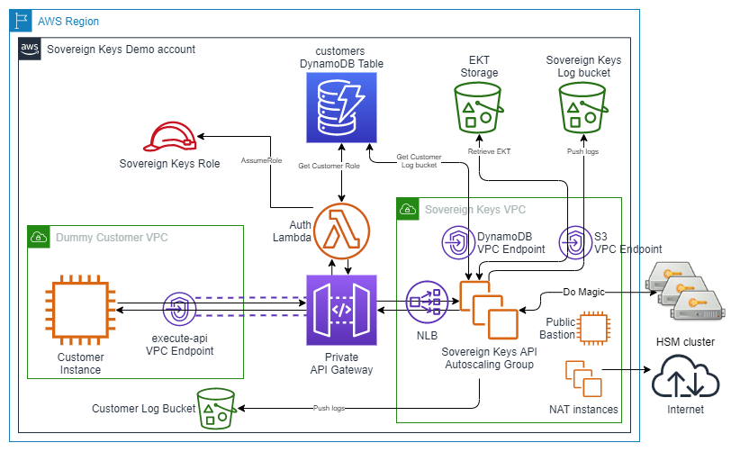
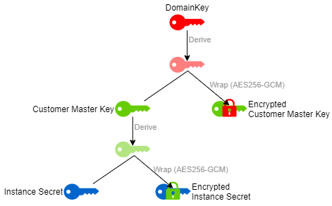

<div id="top"></div>
<!--
*** Thanks for checking out the Best-README-Template. If you have a suggestion
*** that would make this better, please fork the repo and create a pull request
*** or simply open an issue with the tag "enhancement".
*** Don't forget to give the project a star!
*** Thanks again! Now go create something AMAZING! :D
-->


<!-- PROJECT SHIELDS -->
<!--
*** I'm using markdown "reference style" links for readability.
*** Reference links are enclosed in brackets [ ] instead of parentheses ( ).
*** See the bottom of this document for the declaration of the reference variables
*** for contributors-url, forks-url, etc. This is an optional, concise syntax you may use.
*** https://www.markdownguide.org/basic-syntax/#reference-style-links
-->

[![Contributors][contributors-shield]][contributors-url]
[![Forks][forks-shield]][forks-url]
[![Stargazers][stars-shield]][stars-url]
[![Issues][issues-shield]][issues-url]
[![GNU GPLv3 License][license-shield]][license-url]
[![LinkedIn][linkedin-shield]][linkedin-url]


<!-- PROJECT LOGO -->
<br />
<div align="center">
  <a href="https://github.com/d2si/sovereign-keys">
    
  </a>

<h3 align="center">Sovereign Keys</h3>

  <p align="center">
    An encryption system for AWS EC2 instances using external, customer owned HSMs as a backend
    <br />
    <a href="https://github.com/d2si/sovereign-keys"><strong>Explore the docs »</strong></a>
    <br />
    <br />
    <a href="https://github.com/d2si/sovereign-keys">View Demo</a>
    ·
    <a href="https://github.com/d2si/sovereign-keys/issues">Report Bug</a>
    ·
    <a href="https://github.com/d2si/sovereign-keys/issues">Request Feature</a>
  </p>
</div>


<!-- TABLE OF CONTENTS -->
<details>
  <summary>Table of Contents</summary>
  <ol>
    <li>
      <a href="#about-the-project">About The Project</a>
      <ul>
        <li><a href="#built-with">Built With</a></li>
      </ul>
    </li>
    <li>
      <a href="#getting-started">Getting Started</a>
      <ul>
        <li><a href="#prerequisites">Prerequisites</a></li>
        <li><a href="#installation">Installation</a></li>
      </ul>
    </li>
    <li><a href="#architecture">Architecture</a></li>
    <li><a href="#contributing">Contributing</a></li>
    <li><a href="#license">License</a></li>
    <li><a href="#contact">Contact</a></li>
    <li><a href="#acknowledgments">Acknowledgments</a></li>
  </ol>
</details>


<!-- ABOUT THE PROJECT -->
# About The Project

[![Product Name Screen Shot][product-screenshot]](https://example.com)

Sovereignty has become a major concern for companies with the rise of Cloud computing. It has mainly revolved around the protection of data from the Cloud provider itself. `Sovereign Keys` aims to address this question.

First a word of clarification: **NO TECHNICAL SOLUTION** CAN PROVIDE YOU WITH THE **ABSOLUTE CERTAINTY** THAT YOUR CLOUD PROVIDER CANNOT ACCESS THE DATA YOU PROCESS IN THE CLOUD AND `SOVEREIGN KEYS` **DOES NOT** MAKE SUCH A CLAIM.

That being said, `Sovereign Keys` **does** bring you complementary assurances. Genaraly, `Sovereign Keys` is designed around the hyposthesis that your Cloud provider (i.e. AWS) **is not** actively seeking to steal your data for its own gain, but rather that it can be forced by the law to surrender your data to a (foreign) governement. It means that, while `Sovereign Keys` gives you additional data protection guaranties against AWS itself, it is also an excuse that AWS can use to argue they cannot comply with legally issued requests to access your data (e.g. requests issued under the CLOUD Act).

Diving deep into the additional data protection guaranties against AWS itself and the hypothesis we make is not the purpose of this document, nevertheless we can highlight some key points.

The core assumption we make is that AWS **cannot** read the memory (RAM) of a live EC2 instance. Without such an assumption, there is simply nothing we can possibily do at the present time to protect our data. If you believe that this assumption is wrong and you want to protect your data, you should simply not process your data in any Cloud. That being said, this assumption is a realistic one: AWS uses its own Hypervisor technology called [Nitro](https://aws.amazon.com/ec2/nitro/) which does not provide the technical ability to read the instances live memory. This is also verified by a third party.

Given the previous assumption, we can consider two general threat models:
1. AWS can **READ** EBS volumes and network packets. In that case, `Sovereign Keys` will protect your data.
2. AWS can **READ and WRITE** EBS volumes and network packets. In that case, `Sovereign Keys` will not be able to completly negate all the various ways AWS could use to fool the system and retrieve your data **BUT** it should be possible to detect by correlating `Sovereign Keys` logs with your own logs.

<p align="right">(<a href="#top">back to top</a>)</p>


## Supported Cloud provider and service
`Sovereign Keys` only supports Amazon Web Services (AWS) and only such services that allows you to access the Operating System as an administrator.

Such suported services includes:
- EC2 instances
- ECS/EKS worker instances
- Elastic Beanstalk instances
- Lightsail instances

As it does not provide access to the Operating System, Amazon Relational Database Service (RDS) **is NOT supported**.

<p align="right">(<a href="#top">back to top</a>)</p>

## Supported Operating Systems and plateform
Currently, the `Sovereign Keys` agent supports the following Operating System:
- Any Linux distribution as long as LUKS, curl and openssl are available
- Any Windows server after 2012 R2 included

x86, x86_64 and ARM are all supported, depending on the OS support (the agent is really just a bunch of scripts, nothing is compiled).

<p align="right">(<a href="#top">back to top</a>)</p>


## Supported HSMs
Currently, `Sovereign Keys` supports the following Hardware Security Module (HSM) products:
- [AWS CloudHSM (v2)](https://aws.amazon.com/cloudhsm/)
- [Atos (Bull) Trustway Proteccio netHSM](https://atos.net/en/solutions/cyber-security/data-protection-and-governance/hardware-security-module-trustway-proteccio-nethsm)

Additionnal HSMs can be supported but will require additional code. `Sovereign Keys` use the widely implemented [PKCS#11](https://en.wikipedia.org/wiki/PKCS_11) standard to communicate with the HSMs, but unfortunately each vendor has some specifics in its implementation so it is not possible to simply "plug" any HSM.

<p align="right">(<a href="#top">back to top</a>)</p>

<!-- GETTING STARTED -->
# Getting Started

Here are the instructions allowing you to setup and use `Sovereign Keys` in your own AWS account or AWS Organization.

## Prerequisites

In general, this document assumes that you are already familiar with AWS technologies. Though it will provide a link toward the AWS documentation each time it refers to an AWS service for the first time, you are expected to already know how to navigate the AWS Console and/or use the AWS CLI.

The core services sustaining `Sovereign Keys` are:
- [Amazon EC2](https://aws.amazon.com/ec2/) and [Amazon EC2 Autoscaling](https://aws.amazon.com/ec2/autoscaling/)
- [Amazon S3](https://aws.amazon.com/s3/)
- [Amazon DynamoDB](https://aws.amazon.com/dynamodb/)
- [Amazon API Gateway](https://aws.amazon.com/api-gateway/)
- [AWS Lambda](https://aws.amazon.com/lambda/)
- [Network Load Balancer](https://docs.aws.amazon.com/elasticloadbalancing/latest/network/introduction.html) and [Amazon PrivateLink](https://aws.amazon.com/privatelink/)
- And of course, transversal services like [AWS IAM](https://aws.amazon.com/iam/), [Amazon VPC](https://aws.amazon.com/vpc/), [AWS Systems Manager](https://aws.amazon.com/systems-manager/), etc...

In order to simplify the deployement process and minimize assumption about the technologies available to you, everything in this repo is written to work in an AWS-native CICD tooling using:
- [AWS CodePipeline](https://aws.amazon.com/codepipeline/)
- [AWS CodeCommit](https://aws.amazon.com/codecommit/)
- [AWS CodeBuild](https://aws.amazon.com/codebuild/)
- [AWS CloudFormation](https://aws.amazon.com/cloudformation/)

Therefore the only technical AWS prerequisite is that you have an administrator access to some AWS account (technically, you only need admin access to the services previously listed but as it includes AWS IAM you might as well be an account admin).

Finaly, you should be familiar with DevOps tools like `bash`, `git`, `curl` and `ssh` in order to perform the installation steps.

## AWS Costs

By itself, Sovereign keys does not cost much: around $50/month.

If you plan on using your own HSMs, you will probably add VPN costs on top of that, so depending on your configuration, maybe an additional $50-$150/month.

But be warned, if you plan to use [CloudHSM](https://aws.amazon.com/cloudhsm/) as a backend, it will cost anywhere between $2000 and $3000/month depending on the AWS region. See [CloudHSM Pricing](https://aws.amazon.com/cloudhsm/pricing/) for details.

If you just want to make a test, just be sure to shutdown your HSM **nodes** (**DO NOT** remove the **cluster**) as soon as you are not actively testing anymore. It takes only ~15 minutes to get them back online and you will not loose any data because AWS provides an automatic backup/restore mecanism for the cluster. So for example, if you plan to do a 5 days test with 8 hours per day, you can expect the cost of your test do be around $150; providing you don't forget to shutdown your HSM nodes each evening.

## Installation

Every CLI commands given in those installation steps work under the following conditions:
- you are running them in an environment **configured for the target AWS account** you want to use, with the **target region as a default**;
- you don't change the value of the ProjectName when you create the Sovereign Keys CloudFormation stack;
- you use a Linux bash or the Windows Bash sub-system.

The default AWS region for the CLI can be configured like this:
```sh
aws configure set default.region <aws-region-code>
```

### Initial Sovereign Keys provisionning

These steps will create an initial deployement of `Sovereign Keys`. It will not be functional at first because 1/ it will lack an HSM cluster backend and 2/ the `Sovereign Keys` agent cannot be correctly configured before first deploying the `Sovereign Keys` API. The two sections following this one will address those 2 points.

1. Clone the repo and go in it:
    ```sh
    git clone https://github.com/d2si/sovereign-keys.git
    cd sovereign-keys
    ```
2. Use the `pipeline-template.yml` CloudFormation template file at the repo root to create a new stack in your AWS account, making sure you are in the intended region (eu-west-3 and eu-west-1 have been tested but it should work in most regions). You can do it using the AWS console or via CLI, replace `<YourIdentifier>` by the prefix you use in your S3 bucket names:
    ```sh
    # Say you are at the root of the cloned repo
    aws cloudformation create-stack --stack-name sk-stack --template-body file://pipeline-template.yml --capabilities CAPABILITY_NAMED_IAM --parameters ParameterKey=GloballyUniqueCompanyIdentifier,ParameterValue=<YourIdentifier>
    ```
3. Wait for the CloudFormation stack creation to finish (usually it takes ~5min).
    ```sh
    aws cloudformation wait stack-create-complete --stack-name sk-stack
    ```
4. As part of this new CloudFormation stack, a CodeCommit repository have been created named `cc-sovereign-keys-repo`. If you are unsure, you can retrieve the exact name in the CloudFormation Console in the stacks Outputs or via CLI:
    ```sh
    aws cloudformation describe-stacks --stack-name sk-stack --query "Stacks[0].Outputs[?OutputKey=='RepoName'||OutputKey=='RepoUrlSsh'||OutputKey=='RepoUrlHttp'].OutputValue"
    ```
5. Clone the (empty) CodeCommit repository. There are multiple ways to do that, via SSH or HTTPS, please refere to the [CodeCommit AWS documentation](https://docs.aws.amazon.com/codecommit/latest/userguide/how-to-connect.html). Here is the command using the HTTPS URL and aws cli as a credential helper:
    ```sh
    cd ..
    repo_url=$(aws cloudformation describe-stacks --stack-name sk-stack --output text --query "Stacks[0].Outputs[?OutputKey=='RepoUrlHttp'].OutputValue")
    git clone $repo_url -c 'credential.UseHttpPath=true' -c 'credential.helper=!aws codecommit credential-helper'
    ```
6. Copy the entire content of the GitHub Sovereign Keys repository into your CodeCommit repository and commit/push it:
    ```sh
    # Say you are in the common parent folder of both repository
    cp -R sovereign-keys/* cc-sovereign-keys-repo/
    cd cc-sovereign-keys-repo
    git add .
    git commit -m "Initial commit"
    git push
    ```
7. Wait for CodePipeline to works its magic, it will create the Sovereign Keys architecture skeleton with a dummy "customer" VPC (it should take 15-20 minutes). "Skeleton" means without any costly resources like EC2 instances or NLBs: it will allow you to configure the HSM backend without paying idling resources. If you want to know more about the Sovereign Keys architecture, see the see <a href="#architecture">Architecture</a> section.
    ```sh
    aws cloudformation wait stack-exists --stack-name cfn-sovereign-keys-mainstack
    aws cloudformation wait stack-create-complete --stack-name cfn-sovereign-keys-mainstack
    ```

8. Take note of the `Private API Gateway URL`, we will need it later. You can retrieve it in the API Gateway Console or via the CLI:
    ```sh
    aws cloudformation describe-stacks --stack-name cfn-sovereign-keys-mainstack --output text --query "Stacks[0].Outputs[?OutputKey=='ApiUrl'].OutputValue"
    ```

### Configure SSH on the Bastion instance

THe next steps depends heavily on the usage of SSH on the Bastion instance. You SHOULD always use SSH to connect to the Bastion instead of Session Manager, especially when you are configuring secrets. Let's configure your Public SSH key on the bastion instance.

If you don't have an SSH Keypair yet, please create one. For example:
```sh
ssh-keygen -b 2048 -t rsa
```
If you plan on using Putty, that's fine but you are on your own for the configurations (though it is by and large the same logic).

1. Find the bastion EC2 instance that has been created in the `Sovereign Keys` API VPC. It is named `ec2-sovereign-keys-api-bastion`, you can find it in the EC2 Console or via the CLI:
    ```sh
    aws ec2 describe-instances --filters "Name=tag:Name,Values=ec2-sovereign-keys-api-bastion" --output text --query "Reservations[0].Instances[0].InstanceId"
    ```
2. Connect to the bastion using Session Manager. Again, you can do it through the Console or the CLI if you have it pre-configured.
3. You are logged as `ssm-user`, go `root`:
    ```sh
    ####################################
    # Executed on the Bastion instance #
    ####################################
    sudo su
    ```
4. Configure your Public SSH key in the authorized_keys of ec2-user:
    ```sh
    ####################################
    # Executed on the Bastion instance #
    ####################################
    echo <here goes your SSH pub key> >> /home/ec2-user/.ssh/authorized_keys
    ```
5. Logout of the Session Manager session
    ```sh
    ####################################
    # Executed on the Bastion instance #
    ####################################
    exit
    exit
    ```
6. (Optional) If you wish, you can scope down the IP addresses authorized to connect to the Bastion. You can do so by modifying the configuration file `main-configuration.json` at the root of the repository. Add the `BastionAuthorizedRange` with the CIDR block that suits you. The file should look like this:
    ```json
    {
        "Parameters": {
          "ToggleMainResourceCreation": "false",
          "BastionAuthorizedRange": "1.2.3.4/31",
          "InstanceType": "t3.micro",
          "HsmType": "cloudhsm",
          "ObjectLockMode": "GOVERNANCE"
        }
    }
    ```
    Once you made your modification, commit your changes:
    ```sh
    # Say you are at the root of the CodeCommit repository
    git add .
    git commit -m "Scoping down the IPs authorized to SSH into the bastion"
    git push
    ```
7. Test you can SSH into the bastion:
    ```sh
    bastion_ip=$(aws ec2 describe-instances --filters "Name=tag:Name,Values=ec2-sovereign-keys-api-bastion" --output text --query "Reservations[0].Instances[0].PublicIpAddress")
    ssh ec2-user@$bastion_ip
    ```
    Note: It probably wont work from the Windows Bash subsystem because of the way file permission are handled.

### (Alternative 1) Adding a CloudHSM cluster

This steps are only necessary if you plan on using CloudHSM as a backend, either for tests or for production.

The CloudHSM creation process is not entirely repeated in this document as it is very detailled by the AWS documentation. Therefore, we mainly refer to it. You will need access to the `openssl` binary for some of the steps.

1. First create a CloudHSM cluster, following the [AWS documentation](https://docs.aws.amazon.com/cloudhsm/latest/userguide/create-cluster.html). You can use the private subnets of the `Sovereign Keys` VPC or create an additional VPC that you will peer to the `Sovereign Keys` VPC, it's up to you. For the purpose of this document, we assume the cluster is in the same VPC as `Sovereign Keys` API, in the private subnets:
    ```sh
    private_subnets=$(aws ec2 describe-subnets --filters "Name=tag:Name,Values=subnet-sovereign-keys-api-private-*" --output text --query Subnets[].SubnetId | xargs)
    aws cloudhsmv2 create-cluster --hsm-type hsm1.medium --subnet-ids $private_subnets
    ```
    You can verity if it is created or not by describing all clusters (assuming you have only one)
    ```sh
    aws cloudhsmv2 describe-clusters
    ```
    This step will yield the `Cluster Security Group ID` that we will need later (still assuming you have only one cluster) and that we will add on the Bastion:
    ```sh
    cluster_sg=$(aws cloudhsmv2 describe-clusters --output text --query "Clusters[0].SecurityGroup")
    echo "CloudHSM Cluster Security Group ID: $cluster_sg"
    bastion_id=$(aws ec2 describe-instances --filters "Name=tag:Name,Values=ec2-sovereign-keys-api-bastion" --output text --query "Reservations[0].Instances[0].InstanceId")
    bastion_current_sgs=$(aws ec2 describe-instances --instance-id $bastion_id --output text --query "Reservations[0].Instances[0].SecurityGroups[*].GroupId" | xargs)
    bastion_new_sgs="$bastion_current_sgs $cluster_sg"
    aws ec2 modify-instance-attribute --instance-id $bastion_id --groups $bastion_new_sgs
    ```
2. When the cluster State becomes *UNINITIALIZED*, create an HSM in the cluster ([AWS doc](https://docs.aws.amazon.com/cloudhsm/latest/userguide/create-hsm.html)):
    ```sh
    cluster_id=$(aws cloudhsmv2 describe-clusters --output text --query "Clusters[0].ClusterId")
    aws cloudhsmv2 create-hsm --cluster-id $cluster_id --availability-zone $(aws configure get region)a
    ```
3. At this point, you can retrieve the manufacter and the AWS root certificates. If it is for production use, you should verify the HSM identity ([AWS doc](https://docs.aws.amazon.com/cloudhsm/latest/userguide/verify-hsm-identity.html))
4. Initialize the cluster ([AWS doc](https://docs.aws.amazon.com/cloudhsm/latest/userguide/initialize-cluster.html)). This step will yield the `customerCA.crt` certificate that you must copy in the CodeCommit repo: `sovereign-instances/cloudhsm-conf/customerCA.crt`
5. Copy the `customerCA.crt` on the bastion:
    ```sh
    scp customerCA.crt ec2-user@$bastion_ip:customerCA.crt
    ```
6. SSH into the Bastion
7. Configure the CloudHSM client:
    ```sh
    ####################################
    # Executed on the Bastion instance #
    ####################################
    hsm_ip=$(aws cloudhsmv2 describe-clusters --output text --query Clusters[0].Hsms[0].EniIp)
    sudo /opt/cloudhsm/bin/configure -a $hsm_ip
    sudo mv customerCA.crt /opt/cloudhsm/etc
    ```
8. From the bastion, activate the cluster (doc ref: [AWS doc](https://docs.aws.amazon.com/cloudhsm/latest/userguide/activate-cluster.html)). Enter the aws-cloudhsm prompt:
    ```sh
    ####################################
    # Executed on the Bastion instance #
    ####################################
    /opt/cloudhsm/bin/cloudhsm_mgmt_util /opt/cloudhsm/etc/cloudhsm_mgmt_util.cfg
    ```
    Then activate the cluster by changing the PRECO password:
    ```sh
    ####################################
    # Executed on the Bastion instance #
    # In the aws-cloudhsm prompt       #
    ####################################
    listUsers
    loginHSM PRECO admin password
    changePswd PRECO admin <NewPassword>
    logoutHSM
    listUsers
    ```
9. Still in the aws-cloudhsm prompt, create a new **CU** user for Sovereign Keys(doc ref: [AWS doc](https://docs.aws.amazon.com/cloudhsm/latest/userguide/cli-users.html#manage-users)):
    ```sh
    ####################################
    # Executed on the Bastion instance #
    # In the aws-cloudhsm prompt       #
    ####################################
    loginHSM CO admin <your CO password previously created>
    createUser CU skuser <SKUserPassword>
    logoutHSM
    quit
    ```
    Store the credentials somewhere safe /!\ Those credentials will ultimately allow to manipulate `Sovereign Keys` cryptographic keys, therefore there are critical and must remain secret /!\
10. Close the bastion SSH session
    ```sh
    ####################################
    # Executed on the Bastion instance #
    ####################################
    exit
    ```
11. Reconfigure SSL ([AWS doc](https://docs.aws.amazon.com/cloudhsm/latest/userguide/getting-started-ssl.html)) to create a new client certicate and key. It **IS mandatory** for `Sovereign Keys` to work even if the CloudHSM documentation deems it optional. This step will yield the `ssl-client.crt` certificate that you must copy in the CodeCommit repo: `sovereign-instances/cloudhsm-conf/ssl-client.crt`. Keep the `ssl-client.key` somewhere safe.

Let's make a short pitstop here. After going through the CloudHSM cluster creation, you should have the retrieved the following pieces of information:
- The Security Group of the CloudHSM cluster yield at step 1: `Cluster Security Group ID`
- The certificate of the self-signed root CA created at step 5: `customerCA.crt`
- The client certificate used to connect to the HSMs created at step 9: `ssl-client.crt`
- The corresponding secret key also created at step 9: `ssl-client.key` (/!\ SECRET /!\\)
- The `PIN` for the Crypto User (CU) created at step 8, which is a single value composed as follow: *\<cu-login>:\<cu-password>* (/!\ SECRET /!\\). For example, if you created the CU *sk-user* with a password *Password1* then the `PIN` is *sk-user:Password1*.

If you miss any of the previous 5 pieces of information, please verify you followed every previous installation steps correctly.

Some of those informations are not secrets and will be added to your CodeCommit repository:

12. Copy the `customerCA.crt` in the CodeCommit repository: `sovereign-instances/cloudhsm-conf/customerCA.crt`
13. Copy the `ssl-client.crt` in the CodeCommit repository: `sovereign-instances/cloudhsm-conf/ssl-client.crt`
14. Modify the configuration file `main-configuration.json` at the root of the repository, add the `Cluster Security Group ID` as an AdditionalSecurityGroup, ensure the HsmType is *cloudhsm*, modify ToggleMainResourceCreation to *true*. The file should look like this:
    ```json
    {
        "Parameters": {
            "ToggleMainResourceCreation": "true",
            "InstanceType": "t3.micro",
            "HsmType": "cloudhsm",
            "AdditionalSecurityGroup": "<Cluster Security Group ID>",
            "ObjectLockMode": "GOVERNANCE"
        }
    }
    ```
15. Commit and push your modifications:
    ```sh
    # Say you are at the root of the CodeCommit repository
    git add .
    git commit -m "Adding HSM configs and the creating Sovereign Keys cluster"
    git push
    ```
The two secrets, the `PIN` and the `ssl-client.key`, obviously cannot be written into the repo (so **DON'T** write them into the repo). They will be used at the next stage of the installation.

### (Alternative 2) Going for an external Proteccio netHSM cluster

If you plan on using your own Proteccio netHSM cluster, then you must configure some kind of connectivity between the `Sovereign Keys` API VPC and your HSMs (usually a VPN or a DirectConnect). Doing so is beyond the scope of this document, so we will just assume it has been done. It means that you have IP addresses for your HSMs that are reachable from the `Sovereign Keys` API VPC.

Also, note that `Sovereign Keys` **MUST** use client certificates to connect to its backend HSMs. Therefore, your Proteccio netHSM cluster MUST be configured to validate a client certificate. If this is an issue for you, know that it is not too much work to change this behavior and don't hesitate to <a href="#contact">contact us</a> to discuss the subject!

In order to be able to continue the installation using Proteccio netHSMs, you must have the following pieces of information:
- The PKCS#11 bin and lib given to you by Atos (probably in an ISO image), for Linux x86_64, files called: `nethsmstatus`, `libnethsm.so` and `libnethsmanalyze.so`
- The IP addresses of each HSM: `HSM1 IP`, `HSM2 IP`, ...
- The server certificates of each HSM: `HSM1.crt`, `HSM2.crt`, ...
- The client certificate used to connect to the HSMs: `client.crt`;
- The corresponding secret key: `client.key` (/!\ SECRET /!\\);
- The PIN of the Crypto User (CU) `PIN` (/!\ SECRET /!\\).

Some of those informations are not secrets and will be added to your CodeCommit repository:

1. Upload the binary and libraries in the S3 Artifact bucket of the CodePipeline:
    ```sh
    # TODO
    ARTIFACT_BUCKET=TODO
    aws s3 cp nethsmstatus s3://$ARTIFACT_BUCKET/sovereign-instances/proteccio/nethsmstatus
    aws s3 cp libnethsm.so s3://$ARTIFACT_BUCKET/sovereign-instances/proteccio/libnethsm.so
    aws s3 cp libnethsmanalyze.so s3://$ARTIFACT_BUCKET/sovereign-instances/proteccio/libnethsmanalyze.so
    ```
2. Copy each of the `HSM<x>.crt` in the CodeCommit repository: `sovereign-instances/proteccio-conf/HSM<x>.crt`;
3. Copy the `client.crt` in the CodeCommit repository: `sovereign-instances/proteccio-conf/client.crt`;
4. Modify the proteccio.rc file at `sovereign-instances/proteccio-conf/proteccio.rc` with the IPs and certificate filenames:
    ```toml
    [PROTECCIO]
    IPaddr=<HSM1 IP>
    SSL=1
    SrvCert=<HSM1.crt>

    [PROTECCIO]
    IPaddr=<HSM2 IP>
    SSL=1
    SrvCert=<HSM2.crt>

    [CLIENT]
    Mode=2
    shortTimeout=1
    LoggingLevel=7
    LogFile=/home/sk-api/pkcs11.log
    ClntKey=client.key
    ClntCert=client.crt
    ```
    Note that you can choose different names for the certificates, but `client.key` MUST be named `client.key`;
5. Modify the configuration file `main-configuration.json` at the root of the repository, ensure the HsmType is *proteccio*, modify SKVPCNeedNat to *true* and modify ToggleMainResourceCreation to *true*. The file should look like this:
    ```json
    {
        "Parameters": {
            "ToggleMainResourceCreation": "true",
            "InstanceType": "t3.micro",
            "HsmType": "proteccio",
            "ObjectLockMode": "GOVERNANCE"
        }
    }
    ```
    Optionnaly, you can add the IP addresses of your Proteccio HSMs to scope down the `Sovereign Keys` instances proteccio Security Group. You MUST write the addresses in the /32 CIDR form and you can give up to 3 addresses (more will be processed the same as none). For example:
    ```json
    {
        "Parameters": {
            "ToggleMainResourceCreation": "true",
            "InstanceType": "t3.micro",
            "HsmType": "proteccio",
            "HsmIpAddresses": "10.42.1.12/32,10.42.2.12/32",
            "ObjectLockMode": "GOVERNANCE"
        }
    }
    ```
6. Commit and push your modifications:
    ```sh
    # Say you are at the root of the CodeCommit repository
    git add .
    git commit -m "Adding HSM configs and the creating Sovereign Keys cluster"
    git push
    ```

### Finalizing the API installation

Now is the time to make the `Sovereign Keys` API functional by giving it the secrets it needs. The final commit of the previous step will have created the `Sovereign Keys` instances with the relevant configurations. We will now use SSH to go on any instance of the cluster in order to push the client certificate private key `ssl-client.key` (or `client.key` if you are using a Proteccio netHSM backend) and the `PIN`.

1. Connect to the bastion using SSH:
    ```sh
    ################################
    # Executed on your local shell #
    ################################
    ssh ec2-user@$bastion_ip
    ```
2. Assuming the `Sovereign Keys` instances had time to appear, connect to an healthy one using EC2 Instance Connect from the bastion:
    ```sh
    ####################################
    # Executed on the Bastion instance #
    ####################################
    # Describe the Sovereign Keys auto scaling group
    sk_asg_instances=$(aws autoscaling describe-auto-scaling-groups --auto-scaling-group-name asg-sovereign-keys-sovereign-instances)
    # Find an healthy instance that is in service
    sk_instance_id=$(echo $sk_asg_instances | jq -r '[.AutoScalingGroups[0].Instances[]|select(.LifecycleState=="InService" and .HealthStatus=="Healthy")][0].InstanceId')
    # Connect using EC2 Instance Connnect (SSH with a temporary key)
    echo "Connecting to $sk_instance_id"
    mssh $sk_instance_id
    ```
    Note: because they are currently without secrets, the instance cannot interact with the HSMs, therefore they are considered unhealthy by the NLB and the ASG is periodically killing them and creating new ones. The previous commands ensure to connect to an instance still considered healthy, which should give you at least 2 minutes to perform the following steps. If you encounter errors, retry from this step.
3. First we need to give the Private key to the API. In the following script, replace `<content of ssl-client.key>` by the actual content of `ssl-client.key` (or `client.key` if you are using a Proteccio netHSM backend) and paste the result on the Sovereign Keys instance:
    ```sh
    ##################################################
    # Executed on an healthy Sovereign Keys instance #
    ##################################################
    # Ensure the history will not record what we do
    export HISTFILE=/dev/null
    # Create a temporary key file in the instance RAM Store
    cat > /tmp/ram-store/tmp.key << EOF
    <content of ssl-client.key>
    EOF
    # PUT the content in the API through the lo interface
    curl -X PUT -T /tmp/ram-store/tmp.key http://localhost:8080/client-key
    # Remove the temporary key file
    rm -f /tmp/ram-store/tmp.key
    ```
    `curl` should not return anything. If it returns something, it either means the API already has the key due to a previous attempt (the message will be explicit) or there is a problem. In the last case, you should probably go back to step 7.
4. Then we give the password. In the following script, replace `<HSM PIN>` by the actual `PIN`:
    ```sh
    ##################################################
    # Executed on an healthy Sovereign Keys instance #
    ##################################################
    # Ensure the history will not record what we do
    export HISTFILE=/dev/null
    HSM_PIN="<HSM PIN>"
    # PUT the PIN in the API through the lo interface
    curl -H "Content-Type: application/json" -X PUT -d "{\"pin\":\"$HSM_PIN\"}" http://localhost:8080/hsm-pin
    ```
    `curl` should not return anything. If it returns something, it either means the API already has the `PIN` due to a previous attempt (the message will be explicit) or there is a problem. In the last case, you should probably go back to step 7.
5. Disconnect from the `Sovereign Keys` instance
    ```sh
    ##################################################
    # Executed on an healthy Sovereign Keys instance #
    ##################################################
    exit
    ```

If you did not have any errors, congratulations: you have a working `Sovereign Keys` API cluster. The instances will exchange the secrets between them and keep them in their memory. From this point, you will not be able to connect to any of the instances anymore as a safety measure to prevent anyone to retrieve the secrets directly from the instances memory (after a minute or so you can verify this fact by trying step 7 again).

Note: These steps must be repeated each time a fresh `Sovereign Keys` API cluster is created, i.e. each time you change the `main-configuration.json` from ToggleMainResourceCreation=false to ToggleMainResourceCreation=true.

### Configuring the customer agent

Final step of our journey, configurating the customer agent so that we have a working RPM package to distribute and use. We need two informations for those final steps:
- the `Private API Gateway URL`
- the `Sovereign Keys` Public Signing Key: `api_public_key.pem`

We already have the `Private API Gateway URL` from step 8 of <a href="#initial-sovereign-keys-provisionning">Initial Sovereign Keys provisionning</a>, let's retrieve `api_public_key.pem`.

1. Connect to the bastion using SSH (if you cannot, see steps 1 to 5 from <a href="#finalizing-the-api-installation">Finalizing the API installation</a>):
    ```sh
    ################################
    # Executed on your local shell #
    ################################
    ssh ec2-user@$bastion_ip
    ```
2. Retrieve the `Sovereign Keys Public Signing Key` by asking the `Sovereign Keys` API. Replace `<Private API Gateway URL>` by the `Private API Gateway URL`:
    ```sh
    ####################################
    # Executed on the Bastion instance #
    ####################################
    BASE_URL=<Private API Gateway URL>
    # Retrieve EC pub key
    echo Retrieve the SK API signing public key
    RES=$(curl -H "Authorization: osef" -H "Content-Type: application/json" -X GET $BASE_URL/public-signing-key 2>/dev/null)
    cat > ~/api_public_key.pem << EOF
    -----BEGIN PUBLIC KEY-----
    $(echo $RES | jq -r .public_key)
    -----END PUBLIC KEY-----
    EOF
    ```
3. Exit the SSH session
    ```sh
    ####################################
    # Executed on the Bastion instance #
    ####################################
    exit
    ```
4. Copy the file using `scp`
    ```sh
    ################################
    # Executed on your local shell #
    ################################
    scp ec2-user@<bastion-public-ip>:api_public_key.pem .
    ```
5. Copy `api_public_key.pem` in the CodeCommit repository at `agent/linux/sources/etc/sovereign-keys/api_public_key.pem` (override the existing placeholder). For example, the content should look similar to this:
    ```
    -----BEGIN PUBLIC KEY-----
    EXAMPLEEXAMPLEEXAMPLEEXAMPLEEXAMPLEEXAMPLE/Zky5hXNViQJsUZ8MsDM3DB3DmRGP39IOuYALyOiFKrBdcBQNDNAZP8tX5YEeRTjmmS7Ah621enEXSJjdlW3GRjsjOiD2hE4S63ud+pyeQQ4GaiYMd3wrk
    -----END PUBLIC KEY-----
    ```
6. Edit the `agent/linux/sources/etc/sovereign-keys/api_url.txt` and make sure it contains `Private API Gateway URL`. For example, the content should look similar to this:
    ```
    https://example15h.execute-api.eu-west-3.amazonaws.com/v1
    ```
7. Commit and push your modifications:
    ```sh
    # Say you are at the root of the CodeCommit repository
    git add .
    git commit -m "Adding agent static configurations corresponding to the actual Sovereign Keys API"
    git push
    ```
8. At the end of the CodePipeline release process, the RPM package of the agent will be in the artifact S3 bucket. You can retrieve it directly from the console or use the CLI:
    ```sh
    artifact_bucket=$(aws cloudformation list-exports --output text --query "Exports[?Name=='sovereign-keys:S3ArtifactBucketName'].Value")
    aws s3 cp s3://$artifact_bucket/agent/linux/sovereign-keys-0.1.0-1.noarch.rpm .
    ```

<p align="right">(<a href="#top">back to top</a>)</p>

<!-- USAGE EXAMPLES -->
## Usage

Use this space to show useful examples of how a project can be used. Additional screenshots, code examples and demos work well in this space. You may also link to more resources.

_For more examples, please refer to the [Documentation](https://example.com)_

<p align="right">(<a href="#top">back to top</a>)</p>

## Destroy everything

If you were doing a test, you probably want to remove everything and leave your AWS account clean.

Rest assured, destroying is always easier and quicker than creating ;)

### Just a pause before tomorrow

1. Remove the HSM nodes of your cluster. Assuming there is only one cluster:
    ```sh
    cluster_id=$(aws cloudhsmv2 describe-clusters --output text --query "Clusters[0].ClusterId")
    for hsm in $(aws cloudhsmv2 describe-clusters --output text --query "Clusters[0].Hsms[].HsmId" | xargs) ; do aws cloudhsmv2 delete-hsm --cluster-id $cluster_id --hsm-id $hsm ; done
    ```
2. Modify the configuration file `main-configuration.json` at the root of the repository and modify ToggleMainResourceCreation to *false*. The file should look like this:
3. Commit and push your modifications:
    ```sh
    # Say you are at the root of the CodeCommit repository
    git add .
    git commit -m "Toggling off costly resources"
    git push
    ```
4. The bastion will stay online, you can shut it down manually if you wish (it costs $3/month).

### I want to detroy everything

1. Remove the HSM nodes of your cluster. Assuming there is only one cluster:
    ```sh
    cluster_id=$(aws cloudhsmv2 describe-clusters --output text --query "Clusters[0].ClusterId")
    for hsm in $(aws cloudhsmv2 describe-clusters --output text --query "Clusters[0].Hsms[].HsmId" | xargs) ; do aws cloudhsmv2 delete-hsm --cluster-id $cluster_id --hsm-id $hsm ; done
    ```
2. Remove the cluster itself:
    ```sh
    cluster_id=$(aws cloudhsmv2 describe-clusters --output text --query "Clusters[0].ClusterId")
    aws cloudhsmv2 delete-cluster --cluster-id
    ```
3. Empty all the S3 bucket if you can (if you were in COMPLIANCE mode, you can't). If you cannot empty them, CloudFormation will not delete them and they will remain in your account.
4. Delete the `Sovereign Keys` stack and the pipeline stack:
    ```sh
    aws cloudformation delete-stack --stack-name cfn-sovereign-keys-mainstack
    aws cloudformation delete-stack --stack-name sk-stack
    ```


<!-- ARCHITECTURE -->
# Architecture

## Technical Overview

The installation steps you have or will follow ultimatelly deploy the following technical stack:



The HSM cluster is kind of floating in nothingness in this schema, because we don't want to suppose a particular HSM backend architecture but in order for `Sovereign Keys` to work, there MUST be HSMs somewhere. If you are testing the solution, chances are you provisionned some CloudHSM nodes in the Sovereign Keys VPC.

Now this stack is the production stack, but the schema does not give you the full picture. The "dummy" customer VPC is there to test and validate the service but in a real-world example, there will be other VPCs, even in other AWS accounts. They MUST be in the same region though, because we are using the API Gateway endpoint to communicate with the API.

A more "real" architecture would look like this:


It is quite the same, but it shows the fact that multiple VPCs in multiple AWS accounts can use the `Sovereign Keys` API. Also, for a production environment you might not want NAT instances giving Internet access to the API instances but instead use VPC endpoints to only enable the communication with the necessary AWS services.

## Functional Design
`Sovereign Keys` is a system that provide EC2 instances with a secret. This secret is requested by an instance through a local agent and is used to protect a data volume with LUKS or BitLocker depending on the OS. The entire data volume is therefor encrypted at the OS level and data written on the volume never leave the instance in clear-text. This is slightly different from what happen with [AWS KMS](https://aws.amazon.com/kms/) where it is the hypervisor that perform the encryption/decryption process. The `Sovereign Keys` system can be devided between the "API" and the backing HSM. The "API" part is typically hosted on AWS itself, whereas the HSM can be hosted anywhere as long as you can make them available from an [AWS VPC](https://aws.amazon.com/vpc/).

This simple illustration summarize the previous paragraph:


Note that AWS KMS is present on the schema only to underline how it difers from the `Sovereign Keys` encryption; but KMS does not play any role in the architecture: it can be used or not whithout any impact.

<p align="right">(<a href="#top">back to top</a>)</p>

## Cryptographic security
The design choice for `Sovereign Keys` is that **all the cryptographic operations are performed by the HSM, in the HSM, and no customer secret of any kind are ever handled in cleartext by the `Sovereign Keys` API itself**. Random Numbers generation is also made by the HSM so we can have true randomness. Moreover, every cryptographic algorithm used by `Sovereign Keys` are recommanded by the NIST (National Institute of Standards and Technology) and the French ANSSI (Agence Nationale de Securité des Systèmes d'Information) and used within the boundaries of their approbation.

This approach greatly reduce the risks of leaking secrets at multiple levels:
- side-chanel attacks performed by AWS on the cryptographic operations are not possible, especially if you use HSMs hosted outside of the Cloud;
- the compromission of the API itself is less likely to lead to secrets being leaked;
- we leave the care to correctly handle cryptographic algorithms to specialized hardware which reduce the chances of faulty implementation.

<p align="right">(<a href="#top">back to top</a>)</p>

## Key hierarchy

The high-level functional design does not explain how the instance secret is protected by `Sovereign Keys`. So let us describe the key hierarchy and the key residency:



The key hierarchy has 3 levels:
- The `Domain Key`, which is the top level key of `Sovereign Keys`;
- A `Customer Master Key`, which is the top level key for a specific customer;
- An `Instance Secret`, which is specific to a specific instance (and a specific volume).

The `Domain Key` protects the `Customer Master Keys` which in turn protects the `Instance Secrets`. This is a fairly common key hierarchy which we can be represent on a diagram:

You can se on this diagram that there is also unnamed, intermediate, derived keys for the `Domain Key` and for the `Customer Master Key`. From a functionnal standpoint, this can be ignored. It has to do with the cryptographic choice made by `Sovereign Keys`: the wrapping is done using [AES256-GCM](https://en.wikipedia.org/wiki/Galois/Counter_Mode). AES256-GCM is believed to be secure and provides the additional perk that it allows integrity checks natively as well as "Additional Authenticated Data" which we use as part of our authorization mechanism. But AES-GCM fails catastrophically if you ever encrypt different data with the same Initialisation Vector. We will not dive too deep, but just know that using a one-time derived key rather than directly the static key is a good way to avoid that pitfall. The precise derivation mechanism is not on the diagram because it depends on the particular HSM backend used by `Sovereign Keys` (they don't offer the same mecanisms).

Now that we have the hierarchy in mind, it is also usefull to know where each key can exist in cleartext or encrypted form.


The `Domain Key` can only exist in the memory of the HSM backend. The HSM guarantees that it is **NOT POSSIBLE** to extract this key out of it. We make this choice because this key is so critical.

A `Customer Master Key` can only exist in clear-text form inside the HSM. But, as there can be a lot of them, it would be a bad idea to store them all permanently in the HSM, so `Sovereign Keys` use the `Domain Key` to wrap `Customer Master Keys` and store them in an S3 Bucket. As the `Domain Key` cannot exist outside the HSM, it means that a `Customer Master Key` can only be unwrapped inside the HSM.

An `Instance Secret` can exist in clear text in the HSM and in the customer instance RAM. Indeed, the operating System need to know the secret to be able to encrypt/decrypt the EBS volumes. However, the `Instance Secret` is only stored on the instance volume in its wrapped (encrypted) form. `Sovereign Keys` is a mandatory waypoint to retrieve the `Instance Secret` from its wrapped form because it is wrapped using the `Customer Master Key`, which can only be used inside `Sovereign Keys` HSMs.

## Customer instance interactions with Sovereign Keys

Awesome! We know have a good view of the key hierarchy and the key residency. But how does `Sovereign Keys` manages to give the customer instance its `Instance Secret` securely? Indeed, the customer instance **CANNOT** retrieve the `Instance Secret` directly from its wrapped form, only `Sovereign Keys` HSMs can do that. And so we come to the topic of the interactions between `Sovereign Keys` and customer instances. We will not dive to deep, here we just want to get an idea of how it works.

We want to ensure multiple things:
- `Sovereign Keys` should be able to authenticate the customer instance, i.e. verify its identity;
- `Sovereign Keys` should be able to authorize the customer instance, i.e. verify it is allowed to ask for a particular `Instance Secret`;
- `Sovereign Keys` should be able to transmit the `Instance Secret` to the customer instance in a way that prevent others to intercept or modify it.

### Authenticate

Due to the way `Sovereign Keys` is made available to customer instances (see [Private API Gateway](https://docs.aws.amazon.com/apigateway/latest/developerguide/apigateway-private-apis.html) and [Private Link](https://aws.amazon.com/privatelink/)), the private IP address and VPC of the customer instance is exposed to `Sovereign Keys`.


When the customer instance asks for a new secret or to decrypt an existing one, it put its instance ID among the API call parameter. Using some additionnal logic and setup, `Sovereign Keys` is able to assume an IAM Role into the customer AWS account and to verify if the alleged instance ID:
1. do exist;
2. is in the right VPC;
3. has the expected private IP address.

If those conditions are all valid, `Sovereign Keys` considers the instance authenticated.

### Authorize

There is no conventional authorization mechanism implemented in `Sovereign Keys`. This is because the `Instance Secret` is cryptographically linked to an instance ID. Technically, it means that when we first wrap the `Instance Secret` with the `Customer Master Key`, we insert the requesting instance ID in the AES256-GCM Additional Authenticated Data. The way AES256-GCM is implemented guarantees that the HSM will **refuse** to unwrap the `Instance Secret` if `Sovereign Keys` does not provide the exact same Additional Authenticated Data that where provided for the previous wrap operation.

Therefore, if a customer instance tries to ask `Sovereign Keys` to decrypt a secret it does not own, one of two things can happen:
- the "rogue" customer instance tries to include the "owner" instance ID in the decrypt call, in that case the authentication will fail because it is impossible that 2 different instances shares the same IP in the same VPC at the same time;
- the "rogue" customer instance include its own instance ID in the decrypt call, in that case the authentication will succeed but the AES256-GCM Additional Authenticated Data will no longer be correct and the decryption will fail in the HSM.

If you **DO** want to transfer the "ownership" of an `Instance Secret` from one instance to another (e.g. to restore a snapshot to another EC2 instance), there is a special `Sovereign Keys` API call specifically for this operation that will be properly traced in the audit logs.

### Transmit

In order to securely transmit the `Instance Secret` to a customer instance, we use asymetric-encryption with RSA-4096. Each time it need to retrieve an `Instance Secret`, the `Sovereign Keys` agent installed on the customer instance will generate a one-time RSA-4096 key pair and it will send the public key to the `Sovereign Keys` API along with the other parameters.

For exemple, when the customer instance wants to decrypt an existing `Instance Secret`, it looks (very roughly) like that:


It is quite similar in principle when `Sovereign Keys` generates and return a new `Instance Secret`.

### Sequence diagram: Init drive encryption

As additionnal informations, here is a sequence diagram of what happen when a customer instance request a new `Instance Secret`:


### Sequence diagram: Unlock drive

As additionnal informations, here is a sequence diagram of what happen when a customer instance asks to decrypt its existing `Instance Secret`:


### Are those interactions secured against the Cloud provider?

It depends. But ultimately, **no**.

As stated from the very begining of this document, **NOTHING** can ultimately give you a technical immunity against the Cloud provider.

Of course, a precise answer to this question depends on the threat-model you are using, i.e. what do you consider a realistic threat from the Cloud provider in is alleged quest to retrieve your data?

For example, you could consider that your Cloud provider is lying to you from the very begining, that it can read the RAM of your instances, or even that there is special devices plugged on server motherboards to read the data buses: in that case there is absolutly nothing you can do to defend yourself but to simply not put data in the Cloud.

But if you assume that the Cloud provider is simply able to **read** data on EBS volumes or transiting in its network, then `Sovereign Keys` protects your data against the Cloud provider.

Finally, if you assume that the Cloud provider is able to **read and manipulate** data on EBS volumes or transiting in its network (a kind of Superman In The Middle), then `Sovereign Keys` cannot protect your data but will give you temper-proof log-traces of the misbehavior.

And we could create scores of variations of those simple threat-models, each with its unique set of guarantees and flaws. <a href="#contact">Contact us</a> if you would like to discuss the subject!

<p align="right">(<a href="#top">back to top</a>)</p>

<!-- CONTRIBUTING -->
# Contributing

Contributions are what make the open source community such an amazing place to learn, inspire, and create. Any contributions you make are **greatly appreciated**.

If you have a suggestion that would make this better, please fork the repo and create a pull request. You can also simply open an issue with the tag "enhancement".
Don't forget to give the project a star! Thanks again!

1. Fork the Project
2. Create your Feature Branch (`git checkout -b feature/AmazingFeature`)
3. Commit your Changes (`git commit -m 'Add some AmazingFeature'`)
4. Push to the Branch (`git push origin feature/AmazingFeature`)
5. Open a Pull Request

<p align="right">(<a href="#top">back to top</a>)</p>


<!-- LICENSE -->
# License

No license for now. No one can legally use this code.

<p align="right">(<a href="#top">back to top</a>)</p>


<!-- CONTACT -->
# Contact
If you need assistance in using `Sovereign Keys` or if you want us to help you mount a POC (Proof Of Concept), don't hesitate to contact our team: [contact@revolve.team](mailto:contact@revolve.team)

If you wish to make a suggestion or a feature request, see the [open issues](https://github.com/d2si/sovereign-keys/issues) for a full list of proposed features (and known issues).

Project Link: [https://github.com/d2si/sovereign-keys](https://github.com/d2si/sovereign-keys)

<p align="right">(<a href="#top">back to top</a>)</p>


<!-- ACKNOWLEDGMENTS -->
# Acknowledgments

* Jérémie RODON - [@JeremieRodon](https://twitter.com/JeremieRodon) - jeremie@revolve.team

<p align="right">(<a href="#top">back to top</a>)</p>


<!-- MARKDOWN LINKS & IMAGES -->
<!-- https://www.markdownguide.org/basic-syntax/#reference-style-links -->
[contributors-shield]: https://img.shields.io/github/contributors/d2si/sovereign-keys.svg?style=for-the-badge
[contributors-url]: https://github.com/d2si/sovereign-keys/graphs/contributors
[forks-shield]: https://img.shields.io/github/forks/d2si/sovereign-keys.svg?style=for-the-badge
[forks-url]: https://github.com/d2si/sovereign-keys/network/members
[stars-shield]: https://img.shields.io/github/stars/d2si/sovereign-keys.svg?style=for-the-badge
[stars-url]: https://github.com/d2si/sovereign-keys/stargazers
[issues-shield]: https://img.shields.io/github/issues/d2si/sovereign-keys.svg?style=for-the-badge
[issues-url]: https://github.com/d2si/sovereign-keys/issues
[license-shield]: https://img.shields.io/github/license/d2si/sovereign-keys.svg?style=for-the-badge
[license-url]: https://github.com/d2si/sovereign-keys/blob/master/LICENSE.txt
[linkedin-shield]: https://img.shields.io/badge/-LinkedIn-black.svg?style=for-the-badge&logo=linkedin&colorB=555
[linkedin-url]: https://www.linkedin.com/company/devoteam-revolve/mycompany/
[product-screenshot]: images/screenshot.png
